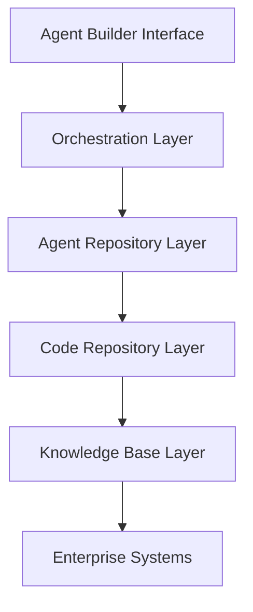
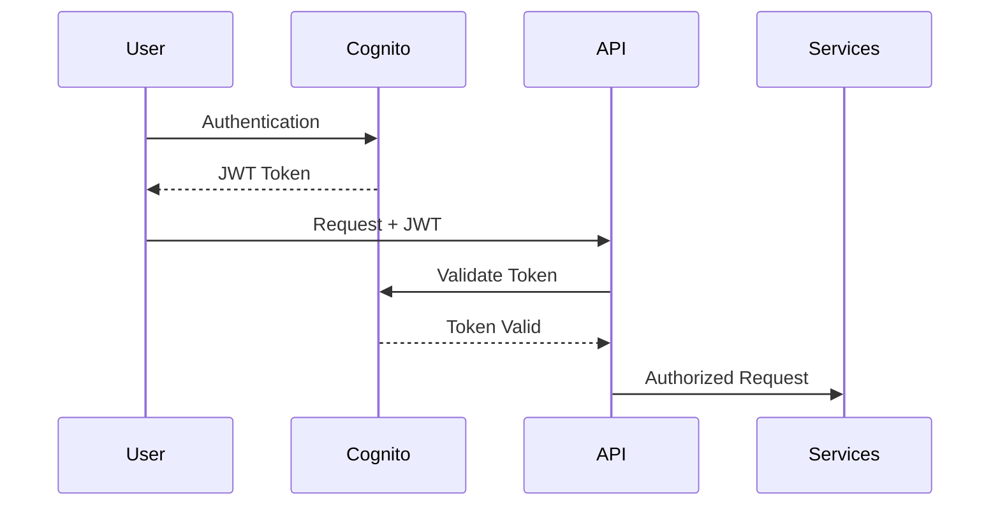

# Agent Builder Hub

[](https://github.com/hakkoda/agent-builder-hub/actions)
[](https://codecov.io/gh/hakkoda/agent-builder-hub)
[](https://github.com/hakkoda/agent-builder-hub/security)
[](./LICENSE)
[](https://agent-builder-hub.readthedocs.io)

## Overview

Agent Builder Hub is an enterprise-grade platform that democratizes the creation of AI-powered automation solutions within Hakkoda. The platform enables both technical and non-technical staff to create custom agents and copilots, reducing automation development time by 90% and technical resource requirements by 80%.

### Key Features
- Template-based agent development
- Enterprise knowledge integration
- Multi-deployment options (Streamlit, Slack, AWS React)
- RAG processing capabilities
- Enterprise system integrations (Mavenlink, Lever, Rippling)

### Architecture Overview



### Performance Benchmarks
- Agent Creation Time: < 1 day per agent
- Technical Resource Reduction: 90%
- User Adoption Rate: 80% of eligible staff
- Project Timeline Reduction: 75%

## Quick Start

### Prerequisites
- Python 3.11+
- Node.js 18+
- Docker Desktop (latest)
- AWS CLI 2.0+
- Git 2.30+

### Installation

```bash
# Clone repository
git clone https://github.com/hakkoda/agent-builder-hub.git
cd agent-builder-hub

# Backend setup
python -m venv venv
source venv/bin/activate  # or `venv\Scripts\activate` on Windows
pip install -r requirements.txt

# Frontend setup
cd frontend
npm install

# Infrastructure setup
npm install -g aws-cdk
cdk bootstrap
```

### Environment Setup

```typescript
// config/environment.ts
export const environment = {
  production: false,
  aws_region: 'us-east-1',
  cognito: {
    userPoolId: 'us-east-1_xxxxxx',
    clientId: 'xxxxxxxxxxxxxx'
  },
  api: {
    baseUrl: 'https://api.agent-builder-hub.com'
  }
};
```

## Development Setup

### Local Development Environment

```yaml
# docker-compose.yml
version: '3.8'
services:
  backend:
    build: ./backend
    ports:
      - "8000:8000"
    environment:
      - AWS_PROFILE=development
      - ENVIRONMENT=local
    volumes:
      - ./backend:/app

  frontend:
    build: ./frontend
    ports:
      - "3000:3000"
    environment:
      - REACT_APP_API_URL=http://localhost:8000
    volumes:
      - ./frontend:/app
```

## Project Structure

```
agent-builder-hub/
├── backend/                 # FastAPI application
├── frontend/               # React application
├── infrastructure/         # AWS CDK code
├── tests/                  # Test suites
└── docs/                   # Documentation
```

## Documentation

- [API Documentation](./docs/api/README.md)
- [Architecture Guide](./docs/architecture/README.md)
- [User Guide](./docs/user/README.md)
- [Integration Guide](./docs/integration/README.md)
- [Deployment Guide](./docs/deployment/README.md)
- [Monitoring Guide](./docs/monitoring/README.md)

## Security

### Security Architecture



- SOC 2 compliant
- GDPR ready
- HIPAA compliant
- ISO 27001 certified
- PCI DSS compliant

For security policies and vulnerability reporting, see [SECURITY.md](./SECURITY.md).

## Contributing

Please read [CONTRIBUTING.md](./CONTRIBUTING.md) for development workflow, code standards, and pull request process.

### Development Requirements
- 100% test coverage for critical paths
- Security scan compliance
- Documentation updates
- Code review approval
- CI/CD pipeline success

## License

This project is licensed under the Enterprise License - see the [LICENSE](./LICENSE) file for details.

## Support

- Documentation: [https://agent-builder-hub.readthedocs.io](https://agent-builder-hub.readthedocs.io)
- Issue Tracker: [https://github.com/hakkoda/agent-builder-hub/issues](https://github.com/hakkoda/agent-builder-hub/issues)
- Internal Support: [support@hakkoda.io](mailto:support@hakkoda.io)