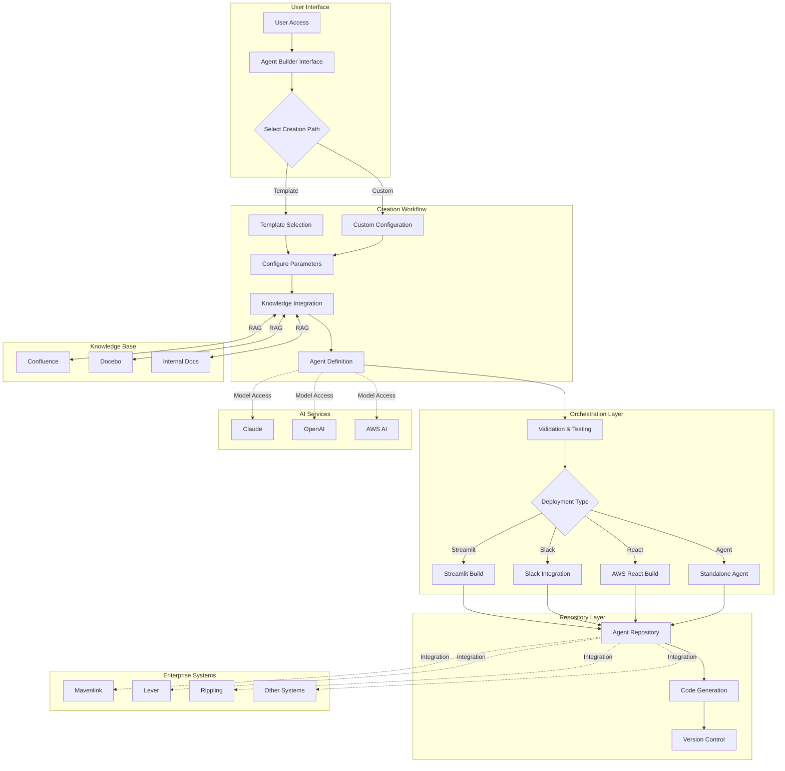
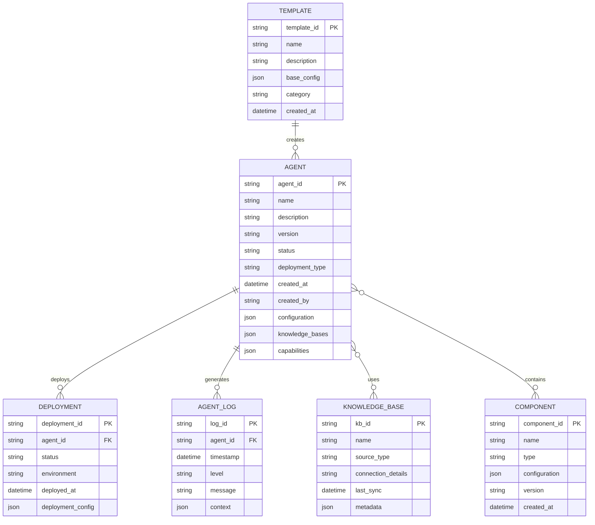
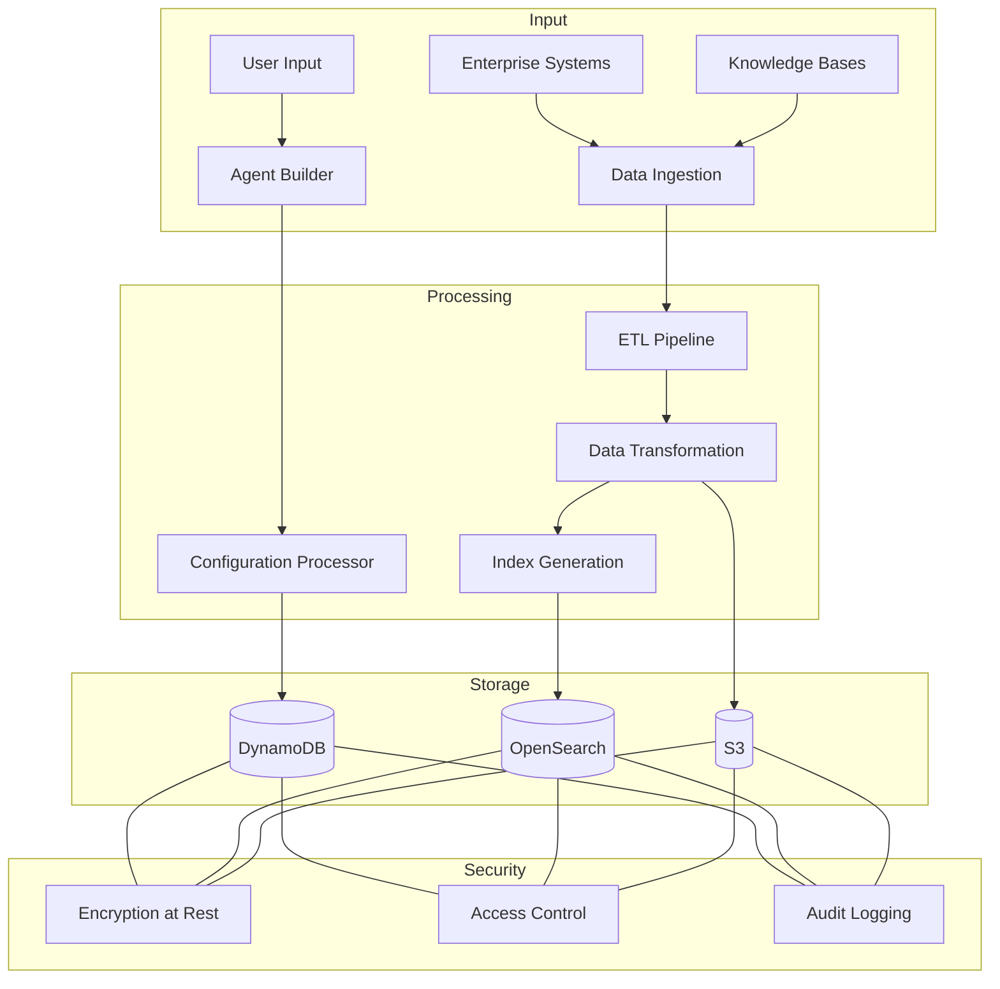

# Product Requirements Document (PRD)

# 1. INTRODUCTION

## 1.1 Purpose

This Product Requirements Document (PRD) specifies the requirements for the Agent Builder Hub, an enterprise-wide platform designed to democratize the creation of AI-powered automation agents and copilots within Hakkoda. This document serves as the primary reference for technical teams, stakeholders, and future maintainers of the system, detailing the functional requirements, technical specifications, and architectural design necessary for successful implementation.

## 1.2 Scope

The Agent Builder Hub will be a comprehensive platform that enables non-technical and technical users to create, deploy, and manage custom AI agents and copilots through a structured framework. The system encompasses:

- A centralized agent builder interface for creating custom automation solutions
- An orchestration layer managing agent interactions and workflows
- A repository system for storing and reusing agent components
- Integration with enterprise knowledge bases including Confluence, Docebo, and internal documentation
- Support for multiple deployment formats (Streamlit apps, Slack integrations, AWS React applications)
- Multi-model AI capabilities leveraging Claude, OpenAI, and AWS services
- Automated code generation and deployment pipelines
- Cross-agent communication and task delegation capabilities
- Integration with enterprise systems (Mavenlink, Lever, Rippling, etc.)

Key benefits include:

- Reduction in manual consulting work through automated solutions
- Democratization of AI agent development across the organization
- Standardization of automation practices and knowledge sharing
- Scalable architecture supporting future enterprise automation needs
- Significant time and resource savings in project delivery

The system will not include:

- Hardware infrastructure management
- Direct client access to the platform
- Manual code deployment processes
- Third-party agent marketplace integration

# 2. PRODUCT DESCRIPTION

## 2.1 Product Perspective

The Agent Builder Hub operates as a central platform within Hakkoda's enterprise technology ecosystem, interfacing with:

- Enterprise Knowledge Systems

  - Confluence documentation
  - Docebo training materials
  - mavenlink project data
  - Internal code repositories
  - Process documentation

- Enterprise Business Systems

  - Mavenlink project management
  - Lever recruitment platform
  - Rippling HR system
  - Email and communication systems
  - Document signing services

- Cloud Infrastructure

  - AWS services
  - Snowflake data platform
  - Development environments

The system architecture consists of five primary layers:

1. Agent Builder Interface Layer
2. Orchestration Layer
3. Agent Repository Layer
4. Code Repository Layer
5. Knowledge Base Layer

## 2.2 Product Functions

- Agent Creation and Management

  - Guided agent development workflow
  - Template-based agent configuration
  - Custom prompt engineering interface
  - Component reuse and sharing
  - Version control and deployment management

- Orchestration Capabilities

  - Cross-agent communication
  - Task delegation and routing
  - Workflow automation
  - State management
  - Error handling and recovery

- Knowledge Integration

  - RAG-based document processing
  - Multi-model AI integration
  - Context-aware responses
  - Enterprise knowledge base connectivity

- Deployment Options

  - Streamlit applications
  - Slack integrations
  - AWS React applications
  - Standalone agents
  - API endpoints

## 2.3 User Characteristics

Primary User Personas:

1. Technical Consultants

   - Advanced programming skills
   - Deep domain expertise
   - Automation-focused mindset
   - Needs: Complex workflow automation, code generation

2. Business Operations Staff

   - Limited technical background
   - Process expertise
   - Data analysis skills
   - Needs: Report automation, process streamlining

3. HR/Administrative Personnel

   - Non-technical background
   - System integration needs
   - Workflow automation requirements
   - Needs: Document automation, multi-system integration

4. Project Managers

   - Mixed technical background
   - Resource optimization focus
   - Process improvement oriented
   - Needs: Project automation, resource management

## 2.4 Constraints

Technical Constraints:

- Must operate within AWS security boundaries
- API rate limits for integrated services
- Performance limitations of AI models
- Storage capacity for knowledge bases

Operational Constraints:

- Internal use only (no external client access)
- Must maintain data privacy compliance
- Required integration with existing enterprise systems
- Authentication through corporate SSO

Resource Constraints:

- Development team capacity
- AI model usage costs
- Infrastructure budget limitations
- Training and support resources

## 2.5 Assumptions and Dependencies

Assumptions:

- Users have basic understanding of their domain requirements
- Enterprise systems maintain stable APIs
- Network connectivity is reliable
- Data quality in knowledge bases is maintained
- AI models remain available and supported

Dependencies:

- Access to enterprise knowledge bases
- Availability of AI model providers
- AWS infrastructure services
- Enterprise system APIs
- Internal documentation maintenance
- Corporate security policies
- Network infrastructure reliability
- Training data quality and availability

# 3. PROCESS FLOWCHART



# 4. FUNCTIONAL REQUIREMENTS

## 4.1 Agent Builder Interface

| ID | Description | Priority |
| --- | --- | --- |
| F1.1 | Guided wizard interface for agent creation with step-by-step configuration | High |
| F1.2 | Template library with pre-configured agent patterns for common use cases | High |
| F1.3 | Custom prompt engineering workspace with testing capabilities | High |
| F1.4 | Knowledge base connector selection and configuration interface | High |
| F1.5 | Deployment format selector (Streamlit, Slack, AWS React, Agent) | Medium |
| F1.6 | Visual workflow designer for agent logic and decision trees | Medium |
| F1.7 | Component library for reusable agent functions and prompts | Medium |

## 4.2 Orchestration System

| ID | Description | Priority |
| --- | --- | --- |
| F2.1 | Cross-agent communication protocol and message routing | High |
| F2.2 | Task delegation and workflow management system | High |
| F2.3 | State management and persistence for long-running operations | High |
| F2.4 | Error handling and automatic recovery mechanisms | High |
| F2.5 | Agent discovery and capability registration | Medium |
| F2.6 | Load balancing and resource allocation | Medium |
| F2.7 | Monitoring and logging system for agent activities | Medium |

## 4.3 Knowledge Integration

| ID | Description | Priority |
| --- | --- | --- |
| F3.1 | RAG-based document processing for enterprise knowledge bases | High |
| F3.2 | Multi-model AI integration (Claude, OpenAI, AWS) | High |
| F3.3 | Automated knowledge base indexing and updates | High |
| F3.4 | Context-aware response generation | High |
| F3.5 | Knowledge base version control and synchronization | Medium |
| F3.6 | Custom knowledge domain creation and management | Medium |
| F3.7 | Knowledge validation and quality assurance | Medium |

## 4.4 Enterprise System Integration

| ID | Description | Priority |
| --- | --- | --- |
| F4.1 | Mavenlink API integration for project and resource data | High |
| F4.2 | Lever API integration for recruitment data | High |
| F4.3 | Rippling API integration for HR operations | High |
| F4.4 | Email system integration for automated communications | High |
| F4.5 | Document signing service integration | Medium |
| F4.6 | Snowflake connectivity for data operations | High |
| F4.7 | AWS services integration for deployment and operations | High |

## 4.5 Code Generation and Management

| ID | Description | Priority |
| --- | --- | --- |
| F5.1 | Automated code generation for selected deployment formats | High |
| F5.2 | Version control system integration | High |
| F5.3 | Code quality validation and testing | High |
| F5.4 | Deployment pipeline automation | High |
| F5.5 | Code repository management and organization | Medium |
| F5.6 | Documentation generation | Medium |
| F5.7 | Code review automation | Low |

## 4.6 Security and Access Control

| ID | Description | Priority |
| --- | --- | --- |
| F6.1 | SSO integration with corporate identity provider | High |
| F6.2 | Role-based access control for agent creation and management | High |
| F6.3 | Secure storage of credentials and sensitive data | High |
| F6.4 | Audit logging of all system activities | High |
| F6.5 | Agent access permission management | Medium |
| F6.6 | Data encryption in transit and at rest | High |
| F6.7 | Security compliance monitoring and reporting | Medium |

# 5. NON-FUNCTIONAL REQUIREMENTS

## 5.1 Performance Requirements

| ID | Requirement | Target Metric |
| --- | --- | --- |
| P1.1 | Agent Builder Interface response time | \< 2 seconds for standard operations |
| P1.2 | Knowledge base query latency | \< 3 seconds for RAG operations |
| P1.3 | Agent deployment time | \< 5 minutes for standard deployments |
| P1.4 | Cross-agent communication latency | \< 1 second per message |
| P1.5 | Concurrent user support | Minimum 100 simultaneous users |
| P1.6 | API integration response time | \< 4 seconds for enterprise system calls |
| P1.7 | Code generation completion time | \< 10 minutes for complex applications |

## 5.2 Safety Requirements

| ID | Requirement | Description |
| --- | --- | --- |
| S1.1 | Automated backup system | Hourly incremental, daily full backups of all configurations |
| S1.2 | Failover mechanisms | Automatic failover to secondary systems within 5 minutes |
| S1.3 | Data loss prevention | Maximum 5-minute data loss window in case of failure |
| S1.4 | System state recovery | Automatic state recovery for interrupted operations |
| S1.5 | Agent isolation | Containerized deployment preventing cross-contamination |
| S1.6 | Resource limits | Enforced CPU, memory, and API call limits per agent |
| S1.7 | Circuit breakers | Automatic service isolation on failure detection |

## 5.3 Security Requirements

| ID | Requirement | Description |
| --- | --- | --- |
| SE1.1 | Authentication | AWS SSO integration with MFA requirement |
| SE1.2 | Authorization | Role-based access control with least privilege principle |
| SE1.3 | Data encryption | AES-256 encryption at rest, TLS 1.3 in transit |
| SE1.4 | Audit logging | Comprehensive logging of all system actions |
| SE1.5 | Credential management | AWS Secrets Manager integration for sensitive data |
| SE1.6 | Network security | VPC isolation and security group enforcement |
| SE1.7 | Vulnerability scanning | Weekly automated security scans |

## 5.4 Quality Requirements

### 5.4.1 Availability

- System uptime: 99.9% excluding planned maintenance
- Maximum planned downtime: 4 hours per month
- Unplanned downtime resolution: \< 2 hours

### 5.4.2 Maintainability

- Modular architecture supporting component updates
- Automated deployment pipelines
- Comprehensive system documentation
- Code coverage minimum: 80%

### 5.4.3 Usability

- Maximum 2-hour training requirement for basic operations
- Intuitive UI with consistent design patterns
- Context-sensitive help system
- Accessibility compliance with WCAG 2.1 Level AA

### 5.4.4 Scalability

- Horizontal scaling capability up to 1000 concurrent users
- Elastic resource allocation based on demand
- Support for 10,000 active agents
- Storage scalability up to 100TB

### 5.4.5 Reliability

- Mean Time Between Failures (MTBF): \> 720 hours
- Mean Time To Recovery (MTTR): \< 30 minutes
- Error rate: \< 0.1% of all operations
- Data consistency guarantee: 99.99%

## 5.5 Compliance Requirements

| ID | Requirement | Description |
| --- | --- | --- |
| C1.1 | SOC 2 Type II | Annual compliance audit and certification |
| C1.2 | GDPR compliance | Data privacy and protection measures |
| C1.3 | HIPAA compatibility | Healthcare data handling capabilities |
| C1.4 | AWS Well-Architected | Adherence to AWS best practices |
| C1.5 | ISO 27001 | Information security management standards |
| C1.6 | Data residency | US-based data storage and processing |
| C1.7 | API standards | RESTful API design compliance |

# 6. DATA REQUIREMENTS

## 6.1 Data Models



## 6.2 Data Storage

### 6.2.1 Primary Storage

- Agent configurations and metadata: AWS DynamoDB
- Knowledge base indices: Amazon OpenSearch Service
- Component repository: Amazon S3
- Deployment artifacts: Amazon S3
- Operational logs: Amazon CloudWatch Logs
- User data and permissions: Amazon RDS (PostgreSQL)

### 6.2.2 Data Retention

| Data Type | Retention Period | Storage Location |
| --- | --- | --- |
| Agent Configurations | Indefinite | DynamoDB |
| Knowledge Base Indices | Rolling 12 months | OpenSearch |
| Deployment Artifacts | 24 months | S3 |
| Operational Logs | 6 months | CloudWatch |
| Audit Trails | 7 years | S3 Glacier |
| User Activity | 12 months | RDS |

### 6.2.3 Backup and Recovery

- DynamoDB: Point-in-time recovery enabled with 35-day window
- RDS: Daily automated backups with 30-day retention
- S3: Cross-region replication with versioning
- OpenSearch: Automated snapshots to S3 every 6 hours
- Recovery Time Objective (RTO): 4 hours
- Recovery Point Objective (RPO): 15 minutes

## 6.3 Data Processing



### 6.3.1 Data Security Controls

- Encryption at rest using AWS KMS
- TLS 1.3 for data in transit
- Field-level encryption for sensitive data
- Data masking for PII/PHI
- Role-based access control (RBAC)
- VPC endpoint isolation
- AWS WAF protection

### 6.3.2 Data Processing Requirements

| Process Type | SLA | Scaling Limits |
| --- | --- | --- |
| Agent Creation | \< 5 minutes | 100 concurrent |
| Knowledge Indexing | \< 30 minutes | 1TB per day |
| RAG Operations | \< 3 seconds | 1000 QPS |
| Log Processing | Near real-time | 10,000 EPS |
| Backup Operations | \< 4 hours | 100TB total |

### 6.3.3 Data Quality Requirements

- Automated schema validation
- Data completeness checks
- Referential integrity enforcement
- Duplicate detection and prevention
- Version control for all configurations
- Automated data quality reporting
- Data lineage tracking

# 7. EXTERNAL INTERFACES

## 7.1 User Interfaces

### 7.1.1 Agent Builder Interface

- Modern web interface built with AWS React
- Responsive design supporting desktop and tablet devices
- Dark/light theme support matching enterprise standards
- Accessibility compliance with WCAG 2.1 Level AA

### 7.1.2 Interface Components

| Component | Description | Requirements |
| --- | --- | --- |
| Agent Creation Wizard | Step-by-step interface | Progressive disclosure, validation feedback |
| Knowledge Base Connector | Visual connection manager | Drag-and-drop capability, connection status indicators |
| Prompt Engineering Workspace | Code editor-style interface | Syntax highlighting, real-time testing |
| Template Gallery | Card-based layout | Filtering, search, preview capabilities |
| Deployment Manager | Dashboard interface | Status monitoring, logs viewer |
| Component Library | Searchable repository | Categorization, version control |

## 7.2 Software Interfaces

### 7.2.1 Enterprise System Integrations

| System | Interface Type | Protocol | Data Format |
| --- | --- | --- | --- |
| Mavenlink | REST API | HTTPS | JSON |
| Lever | REST API | HTTPS | JSON |
| Rippling | REST API | HTTPS | JSON |
| Confluence | REST API | HTTPS | JSON |
| Docebo | REST API | HTTPS | JSON |
| Snowflake | JDBC/ODBC | TCP | SQL/JSON |
| DocuSign | REST API | HTTPS | JSON |

### 7.2.2 Cloud Service Interfaces

| Service | Interface Type | Purpose |
| --- | --- | --- |
| AWS Lambda | SDK/API | Serverless compute |
| Amazon S3 | SDK/API | Object storage |
| DynamoDB | SDK/API | NoSQL database |
| OpenSearch | SDK/API | Search and analytics |
| CloudWatch | SDK/API | Monitoring and logging |
| AWS Cognito | SDK/API | Authentication |
| AWS SageMaker | SDK/API | ML model deployment |

### 7.2.3 AI Model Interfaces

| Provider | Interface | Authentication |
| --- | --- | --- |
| Claude | REST API | API Key |
| OpenAI | REST API | API Key |
| AWS Bedrock | SDK/API | IAM Role |
| AWS CodeWhisperer | SDK/API | IAM Role |

## 7.3 Communication Interfaces

### 7.3.1 Internal Communication

| Protocol | Usage | Format |
| --- | --- | --- |
| WebSocket | Real-time agent communication | JSON |
| gRPC | High-performance service communication | Protocol Buffers |
| REST | Standard API communication | JSON |
| GraphQL | Complex data queries | JSON |

### 7.3.2 External Communication

| Protocol | Usage | Security |
| --- | --- | --- |
| HTTPS | External API calls | TLS 1.3 |
| SMTP | Email notifications | TLS/STARTTLS |
| OAuth 2.0 | Authentication flows | JWT |
| SAML 2.0 | SSO integration | X.509 certificates |

### 7.3.3 Message Formats

```json
{
  "agent_communication": {
    "message_type": "task_delegation",
    "source_agent": "string",
    "target_agent": "string",
    "payload": {
      "task_id": "string",
      "parameters": {},
      "priority": "integer",
      "timeout": "integer"
    },
    "metadata": {
      "timestamp": "string",
      "correlation_id": "string",
      "version": "string"
    }
  }
}
```

## 7.4 Network Interfaces

| Interface Type | Protocol | Port | Purpose |
| --- | --- | --- | --- |
| VPC Endpoint | HTTPS | 443 | AWS Services |
| VPC Peering | TCP/IP | Various | Cross-VPC Communication |
| AWS PrivateLink | HTTPS | 443 | Enterprise System Access |
| VPN | IPSec | 500/4500 | Corporate Network Access |

# 8. APPENDICES

## 8.1 GLOSSARY

| Term | Definition |
| --- | --- |
| Agent | An AI-powered automation component capable of performing specific tasks or workflows |
| Copilot | An AI assistant designed to augment human work in specific domains |
| RAG | Retrieval Augmented Generation - technique combining knowledge base retrieval with AI generation |
| Data Vault | A database modeling methodology optimized for enterprise data warehouses |
| DBT | Data Build Tool - a transformation framework for analytics engineering |
| Report Rationalization | Process of analyzing and consolidating redundant or unnecessary reports |
| Stored Procedure | Database program stored and executed on a database server |
| Value Pool | Collection of domain-specific knowledge and best practices |
| Template | Pre-configured agent pattern for common use cases |
| Component | Reusable function or capability that can be shared between agents |

## 8.2 ACRONYMS

| Acronym | Definition |
| --- | --- |
| API | Application Programming Interface |
| AWS | Amazon Web Services |
| BI | Business Intelligence |
| EPS | Events Per Second |
| GDPR | General Data Protection Regulation |
| HIPAA | Health Insurance Portability and Accountability Act |
| HR | Human Resources |
| IAM | Identity and Access Management |
| JSON | JavaScript Object Notation |
| JWT | JSON Web Token |
| KMS | Key Management Service |
| MFA | Multi-Factor Authentication |
| MTBF | Mean Time Between Failures |
| MTTR | Mean Time To Recovery |
| PII | Personally Identifiable Information |
| PHI | Protected Health Information |
| QPS | Queries Per Second |
| RBAC | Role-Based Access Control |
| REST | Representational State Transfer |
| RTO | Recovery Time Objective |
| RPO | Recovery Point Objective |
| SAML | Security Assertion Markup Language |
| SDK | Software Development Kit |
| SI | System Integrator |
| SLA | Service Level Agreement |
| SMTP | Simple Mail Transfer Protocol |
| SOC | System and Organization Controls |
| SQL | Structured Query Language |
| SSO | Single Sign-On |
| TLS | Transport Layer Security |
| VPC | Virtual Private Cloud |
| WCAG | Web Content Accessibility Guidelines |

## 8.3 ADDITIONAL REFERENCES

| Reference | Description | URL/Location |
| --- | --- | --- |
| AWS Well-Architected Framework | Best practices for AWS architecture | aws.amazon.com/architecture/well-architected |
| Snowflake Documentation | Technical documentation for Snowflake integration | docs.snowflake.com |
| Claude API Documentation | Integration guide for Claude AI model | anthropic.com/claude/docs |
| OpenAI API Reference | Technical documentation for OpenAI services | platform.openai.com/docs |
| DBT Documentation | Best practices for DBT implementations | docs.getdbt.com |
| Data Vault 2.0 Standards | Reference for Data Vault modeling | datavaultalliance.com |
| WCAG 2.1 Guidelines | Web accessibility standards | w3.org/WAI/WCAG21 |
| OAuth 2.0 Specification | Authentication protocol documentation | oauth.net/2 |
| AWS Bedrock Documentation | AWS foundation model service documentation | aws.amazon.com/bedrock |
| Streamlit Documentation | Framework for rapid app development | docs.streamlit.io |