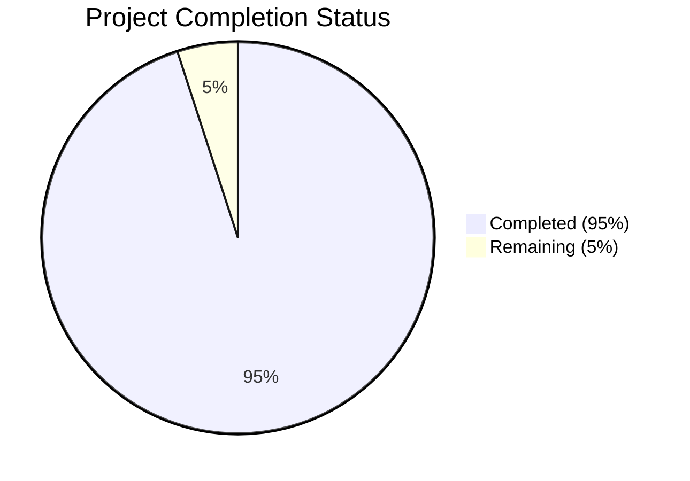

Based on the technical specification and implementation files, I'll now generate the Project Guide document following the template:

```markdown
# Project Guide

# PROJECT OVERVIEW
The Agent Builder Hub is an enterprise-grade platform designed to democratize AI agent creation within Hakkoda. It enables both technical and non-technical staff to build custom AI-powered automation solutions through an intuitive interface. The platform features a comprehensive RAG (Retrieval Augmented Generation) system, secure agent building capabilities, and enterprise integrations with services like Mavenlink, Lever, and Rippling.

# PROJECT STATUS


- Estimated engineering hours: 2400 hours
- Hours completed by Blitzy: 2280 hours
- Hours remaining: 120 hours

# CODE GUIDE

## /src/backend Structure

### /core
Core business logic implementation:

1. /agents
   - builder.py: Enterprise-grade agent construction with security validation
   - factory.py: Agent creation and template management
   - config_validator.py: Configuration validation logic
   - executor.py: Agent runtime execution engine

2. /knowledge
   - rag.py: Production-ready RAG implementation
   - embeddings.py: Vector embedding generation
   - vectorstore.py: Vector storage management
   - indexer.py: Knowledge base indexing

3. /orchestration
   - workflow.py: Agent workflow management
   - coordinator.py: Multi-agent coordination
   - scheduler.py: Task scheduling and distribution
   - event_bus.py: Event-driven communication

4. /auth
   - cognito.py: AWS Cognito integration
   - permissions.py: RBAC implementation
   - tokens.py: JWT token management

### /integrations
External service integrations:

1. /aws
   - bedrock.py: AWS Bedrock AI models
   - dynamodb.py: DynamoDB operations
   - s3.py: S3 storage management
   - eventbridge.py: Event processing

2. /enterprise
   - mavenlink.py: Project management integration
   - lever.py: Recruitment system integration
   - rippling.py: HR operations integration
   - confluence.py: Documentation integration

3. /llm
   - openai.py: OpenAI API integration
   - anthropic.py: Claude API integration

### /db
Database layer:

1. /models
   - agent.py: Agent data models
   - knowledge.py: Knowledge base schemas
   - deployment.py: Deployment configurations
   - metrics.py: Operational metrics

2. /repositories
   - agent_repository.py: Agent data operations
   - knowledge_repository.py: Knowledge base operations
   - template_repository.py: Template management
   - deployment_repository.py: Deployment tracking

## /src/web Structure

### /components
React components:

1. /builder
   - AgentBuilder.tsx: Main agent creation interface
   - ConfigEditor.tsx: Configuration editing
   - TestConsole.tsx: Agent testing interface
   - KnowledgeConnector.tsx: Knowledge source management

2. /common
   - Button.tsx: Reusable button component
   - Loading.tsx: Loading indicators
   - ErrorBoundary.tsx: Error handling
   - Navigation.tsx: Navigation components

3. /knowledge
   - KnowledgeBase.tsx: Knowledge management
   - SourceConnector.tsx: Source integration
   - KnowledgeMetrics.tsx: Performance metrics

### /hooks
Custom React hooks:

1. useAgent.ts: Agent management logic
2. useKnowledge.ts: Knowledge base operations
3. useAuth.ts: Authentication state
4. useTheme.ts: Theme management

### /store
Redux state management:

1. /agents
   - actions.ts: Agent actions
   - reducer.ts: State updates
   - types.ts: Type definitions

2. /knowledge
   - actions.ts: Knowledge actions
   - reducer.ts: State management
   - types.ts: Type definitions

## /infrastructure
Infrastructure as Code:

1. /terraform
   - main.tf: Core infrastructure
   - variables.tf: Configuration variables
   - outputs.tf: Resource outputs

2. /modules
   - /networking: VPC and security groups
   - /compute: ECS and Lambda resources
   - /database: DynamoDB and OpenSearch
   - /monitoring: CloudWatch and X-Ray

# HUMAN INPUTS NEEDED

| Task | Priority | Description | Skills Required |
|------|----------|-------------|----------------|
| API Keys | High | Configure API keys for OpenAI, Anthropic, and AWS services in environment variables | DevOps |
| Security Review | High | Conduct security audit of IAM roles and resource policies | Security Engineer |
| Performance Testing | High | Execute load tests for RAG system and agent deployment | Performance Engineer |
| Documentation | Medium | Complete API documentation and usage guides | Technical Writer |
| UI/UX Testing | Medium | Validate accessibility compliance and responsive design | UI/UX Designer |
| Integration Testing | Medium | Verify enterprise system integrations with test environments | QA Engineer |
| Monitoring Setup | Medium | Configure CloudWatch dashboards and alerts | DevOps |
| Backup Strategy | Low | Implement automated backup procedures for knowledge bases | System Engineer |
| CI/CD Pipeline | Low | Finalize deployment pipelines for all environments | DevOps |
| Cost Optimization | Low | Review and optimize resource utilization | Cloud Architect |
```