# Technical Specifications

# 1. INTRODUCTION

## 1.1 EXECUTIVE SUMMARY

The Agent Builder Hub represents a transformative enterprise platform designed to democratize the creation of AI-powered automation solutions within Hakkoda. By enabling both technical and non-technical staff to create custom agents and copilots, the system addresses the critical challenge of scaling automation capabilities across the organization while reducing dependency on specialized development teams. The platform leverages Hakkoda's extensive experience in building successful automation solutions, such as the BI migration copilot that reduced project timelines from 10 months to 6 weeks, and extends this capability to all organizational domains.

This system will empower employees across departments to create purpose-built automation agents through an intuitive interface while maintaining enterprise-grade security, scalability, and integration capabilities. The expected impact includes a 90% reduction in automation development time, 80% decrease in technical resource requirements, and significant acceleration of project delivery timelines.

## 1.2 SYSTEM OVERVIEW

### Project Context

| Aspect | Description |
|--------|-------------|
| Business Context | Leading data consulting firm specializing in AWS and Snowflake implementations |
| Current Limitations | Manual development of automation solutions requiring specialized AI expertise |
| Market Position | Innovation leader in automated consulting service delivery |
| Enterprise Integration | Core component of digital transformation strategy integrating with existing enterprise systems |

### High-Level Description

The Agent Builder Hub consists of five architectural layers:

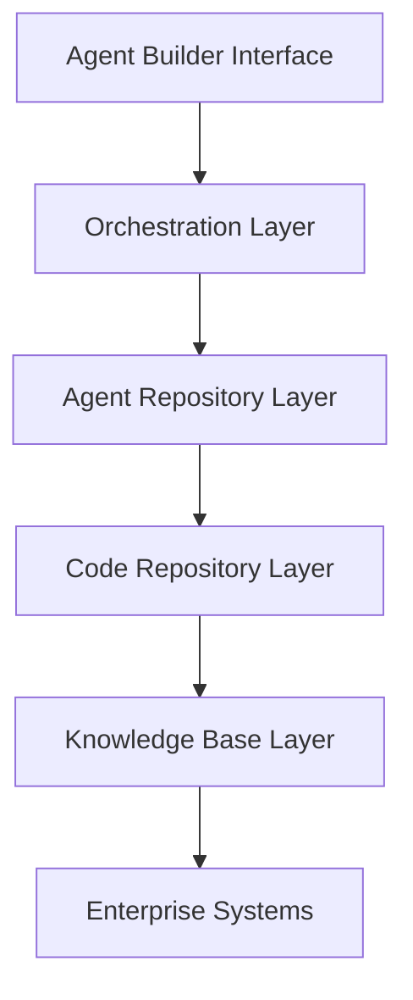
```mermaid
graph TD
    A[Agent Builder Interface] --> B[Orchestration Layer]
    B --> C[Agent Repository Layer]
    C --> D[Code Repository Layer]
    D --> E[Knowledge Base Layer]
    E --> F[Enterprise Systems]
```

| Component | Primary Capability |
|-----------|-------------------|
| Agent Builder Interface | Guided agent creation and configuration |
| Orchestration Layer | Cross-agent communication and workflow management |
| Agent Repository Layer | Reusable component storage and version control |
| Code Repository Layer | Automated code generation and deployment |
| Knowledge Base Layer | Enterprise knowledge integration and RAG capabilities |

### Success Criteria

| Category | Metric | Target |
|----------|---------|--------|
| Development Efficiency | Agent Creation Time | < 1 day per agent |
| Resource Optimization | Technical Resource Requirements | 90% reduction |
| User Adoption | Active Users | 80% of eligible staff |
| Business Impact | Project Delivery Timeline | 75% reduction |

## 1.3 SCOPE

### In-Scope Elements

#### Core Features and Functionalities

| Feature Category | Components |
|-----------------|------------|
| Agent Creation | Template-based development, Custom configuration, Knowledge integration |
| Deployment Options | Streamlit apps, Slack integrations, AWS React apps, Standalone agents |
| Enterprise Integration | Mavenlink, Lever, Rippling, Snowflake, AWS services |
| AI Capabilities | RAG processing, Multi-model support, Context-aware responses |

#### Implementation Boundaries

| Boundary Type | Coverage |
|--------------|----------|
| User Groups | Internal Hakkoda staff across all departments |
| System Access | Enterprise-wide with role-based permissions |
| Data Domains | HR, Finance, Engineering, Operations, Analytics |
| Geographic Scope | Global organization coverage |

### Out-of-Scope Elements

| Category | Excluded Elements |
|----------|------------------|
| External Access | Client-facing agent creation capabilities |
| Infrastructure | Hardware infrastructure management |
| Development | Manual code deployment processes |
| Integration | Third-party agent marketplace integration |
| Support | 24/7 operational support |
| Custom Development | One-off agent customization requests |
| Training | External user training programs |
| Data Processing | Real-time streaming data processing |

# 2. SYSTEM ARCHITECTURE

## 2.1 High-Level Architecture

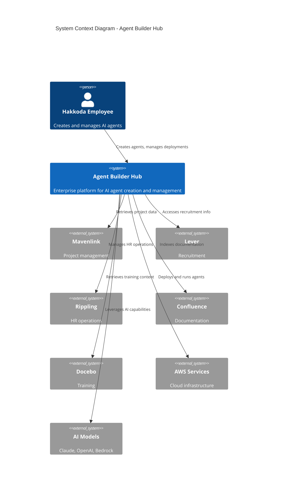
```mermaid
C4Context
    title System Context Diagram - Agent Builder Hub

    Person(user, "Hakkoda Employee", "Creates and manages AI agents")
    System(agentBuilder, "Agent Builder Hub", "Enterprise platform for AI agent creation and management")
    
    System_Ext(mavenlink, "Mavenlink", "Project management")
    System_Ext(lever, "Lever", "Recruitment")
    System_Ext(rippling, "Rippling", "HR operations")
    System_Ext(confluence, "Confluence", "Documentation")
    System_Ext(docebo, "Docebo", "Training")
    System_Ext(aws, "AWS Services", "Cloud infrastructure")
    System_Ext(aiModels, "AI Models", "Claude, OpenAI, Bedrock")

    Rel(user, agentBuilder, "Creates agents, manages deployments")
    Rel(agentBuilder, mavenlink, "Retrieves project data")
    Rel(agentBuilder, lever, "Accesses recruitment info")
    Rel(agentBuilder, rippling, "Manages HR operations")
    Rel(agentBuilder, confluence, "Indexes documentation")
    Rel(agentBuilder, docebo, "Retrieves training content")
    Rel(agentBuilder, aws, "Deploys and runs agents")
    Rel(agentBuilder, aiModels, "Leverages AI capabilities")
```

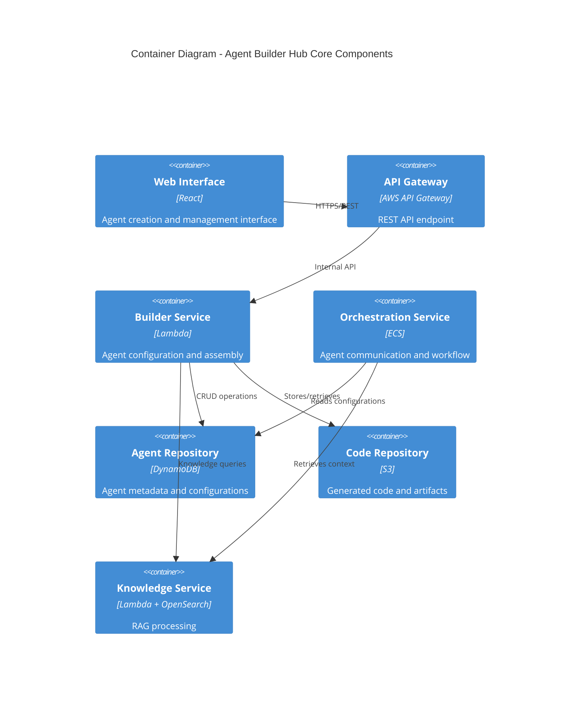
```mermaid
C4Container
    title Container Diagram - Agent Builder Hub Core Components

    Container(ui, "Web Interface", "React", "Agent creation and management interface")
    Container(api, "API Gateway", "AWS API Gateway", "REST API endpoint")
    Container(builder, "Builder Service", "Lambda", "Agent configuration and assembly")
    Container(orch, "Orchestration Service", "ECS", "Agent communication and workflow")
    Container(repo, "Agent Repository", "DynamoDB", "Agent metadata and configurations")
    Container(code, "Code Repository", "S3", "Generated code and artifacts")
    Container(kb, "Knowledge Service", "Lambda + OpenSearch", "RAG processing")
    
    Rel(ui, api, "HTTPS/REST")
    Rel(api, builder, "Internal API")
    Rel(builder, repo, "CRUD operations")
    Rel(builder, code, "Stores/retrieves")
    Rel(builder, kb, "Knowledge queries")
    Rel(orch, repo, "Reads configurations")
    Rel(orch, kb, "Retrieves context")
```

## 2.2 Component Details

### 2.2.1 Core Components

| Component | Technology | Purpose | Scaling Strategy |
|-----------|------------|---------|------------------|
| Web Interface | React, AWS Amplify | Agent creation and management UI | Horizontal scaling via CDN |
| API Gateway | AWS API Gateway | REST API endpoint and request routing | Auto-scaling with usage plans |
| Builder Service | AWS Lambda | Agent configuration and generation | Concurrent execution scaling |
| Orchestration Service | Amazon ECS | Agent workflow management | ECS cluster auto-scaling |
| Agent Repository | DynamoDB | Configuration and metadata storage | On-demand capacity scaling |
| Code Repository | S3 | Artifact and code storage | Unlimited scaling with partitioning |
| Knowledge Service | Lambda + OpenSearch | RAG processing and knowledge retrieval | Cluster scaling with demand |

### 2.2.2 Data Flow Architecture

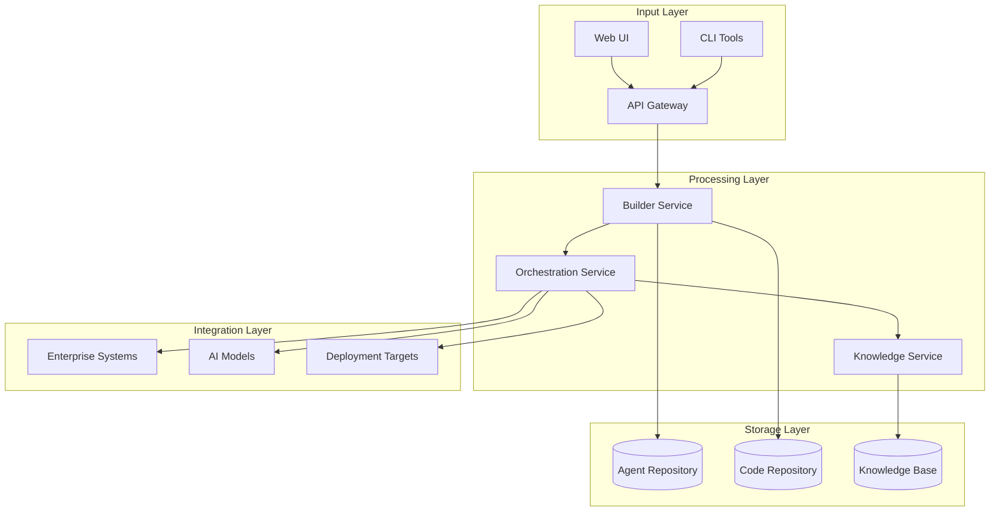
```mermaid
flowchart TB
    subgraph Input Layer
        A[Web UI] --> B[API Gateway]
        C[CLI Tools] --> B
    end

    subgraph Processing Layer
        B --> D[Builder Service]
        D --> E[Orchestration Service]
        E --> F[Knowledge Service]
    end

    subgraph Storage Layer
        D --> G[(Agent Repository)]
        D --> H[(Code Repository)]
        F --> I[(Knowledge Base)]
    end

    subgraph Integration Layer
        E --> J[Enterprise Systems]
        E --> K[AI Models]
        E --> L[Deployment Targets]
    end
```

## 2.3 Technical Decisions

### 2.3.1 Architecture Patterns

| Pattern | Implementation | Justification |
|---------|----------------|---------------|
| Microservices | AWS Lambda + ECS | Scalability and independent deployment |
| Event-Driven | EventBridge | Loose coupling and async operations |
| CQRS | DynamoDB Streams | Data consistency and performance |
| API Gateway | REST + WebSocket | Flexible communication patterns |
| RAG Processing | Vector Store + LLM | Enhanced context awareness |

### 2.3.2 Deployment Architecture

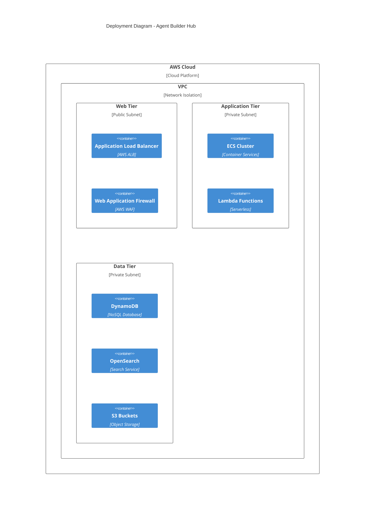
```mermaid
C4Deployment
    title Deployment Diagram - Agent Builder Hub

    Deployment_Node(aws, "AWS Cloud", "Cloud Platform") {
        Deployment_Node(vpc, "VPC", "Network Isolation") {
            Deployment_Node(web, "Web Tier", "Public Subnet") {
                Container(alb, "Application Load Balancer", "AWS ALB")
                Container(waf, "Web Application Firewall", "AWS WAF")
            }
            
            Deployment_Node(app, "Application Tier", "Private Subnet") {
                Container(ecs, "ECS Cluster", "Container Services")
                Container(lambda, "Lambda Functions", "Serverless")
            }
            
            Deployment_Node(data, "Data Tier", "Private Subnet") {
                Container(ddb, "DynamoDB", "NoSQL Database")
                Container(os, "OpenSearch", "Search Service")
                Container(s3, "S3 Buckets", "Object Storage")
            }
        }
    }
```

## 2.4 Cross-Cutting Concerns

### 2.4.1 Monitoring and Observability

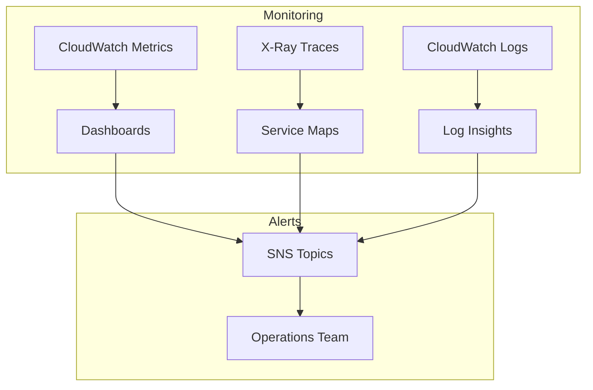
```mermaid
graph TB
    subgraph Monitoring
        A[CloudWatch Metrics] --> B[Dashboards]
        C[X-Ray Traces] --> D[Service Maps]
        E[CloudWatch Logs] --> F[Log Insights]
    end

    subgraph Alerts
        B --> G[SNS Topics]
        D --> G
        F --> G
        G --> H[Operations Team]
    end
```

### 2.4.2 Security Architecture

| Layer | Mechanism | Implementation |
|-------|-----------|----------------|
| Network | VPC isolation | Private subnets, NACLs, Security Groups |
| Application | WAF rules | Request filtering, rate limiting |
| Data | Encryption | KMS encryption at rest, TLS in transit |
| Identity | IAM + Cognito | Role-based access control |
| Audit | CloudTrail | Comprehensive activity logging |

### 2.4.3 Error Handling and Recovery

| Scenario | Strategy | Recovery Time |
|----------|----------|---------------|
| Service Failure | Circuit breaker pattern | < 30 seconds |
| Data Corruption | Point-in-time recovery | < 1 hour |
| Region Failure | Cross-region replication | < 4 hours |
| System-wide Outage | DR failover | < 8 hours |

### 2.4.4 Performance Requirements

| Component | Metric | Target |
|-----------|--------|--------|
| API Gateway | Response Time | < 100ms |
| Builder Service | Processing Time | < 5s |
| Knowledge Service | Query Latency | < 2s |
| Storage Operations | Read/Write Latency | < 10ms |
| Cross-service Communication | End-to-end Latency | < 1s |

# 3. SYSTEM COMPONENTS ARCHITECTURE

## 3.1 USER INTERFACE DESIGN

### 3.1.1 Design Specifications

| Category | Requirement | Details |
|----------|-------------|----------|
| Visual Hierarchy | Material Design 3.0 | Consistent spacing, typography, and elevation |
| Component Library | AWS Amplify UI | Pre-built React components with AWS integration |
| Responsive Design | Mobile-first | Breakpoints at 320px, 768px, 1024px, 1440px |
| Accessibility | WCAG 2.1 Level AA | Full keyboard navigation, ARIA labels, contrast ratios |
| Browser Support | Modern Browsers | Chrome 90+, Firefox 88+, Safari 14+, Edge 90+ |
| Theme Support | Dark/Light | System preference detection, manual override |
| Internationalization | English Only (Phase 1) | UTF-8 encoding, extensible for future languages |

### 3.1.2 Interface Layout

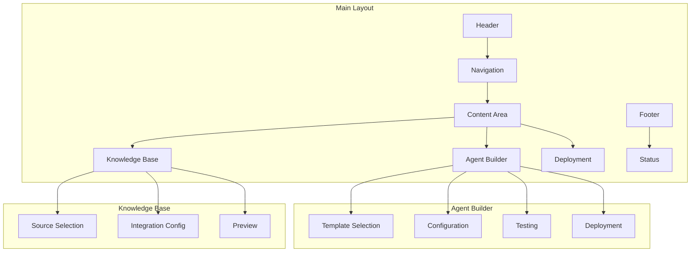
```mermaid
graph TD
    subgraph Main Layout
        A[Header] --> B[Navigation]
        B --> C[Content Area]
        C --> D[Agent Builder]
        C --> E[Knowledge Base]
        C --> F[Deployment]
        G[Footer] --> H[Status]
    end

    subgraph Agent Builder
        D --> I[Template Selection]
        D --> J[Configuration]
        D --> K[Testing]
        D --> L[Deployment]
    end

    subgraph Knowledge Base
        E --> M[Source Selection]
        E --> N[Integration Config]
        E --> O[Preview]
    end
```

### 3.1.3 Critical User Flows

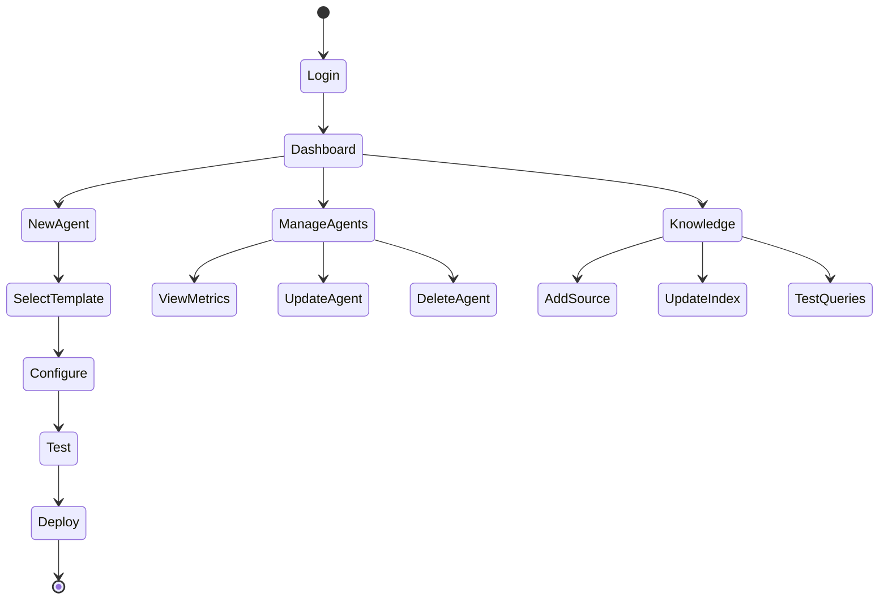
```mermaid
stateDiagram-v2
    [*] --> Login
    Login --> Dashboard
    Dashboard --> NewAgent
    Dashboard --> ManageAgents
    Dashboard --> Knowledge

    NewAgent --> SelectTemplate
    SelectTemplate --> Configure
    Configure --> Test
    Test --> Deploy
    Deploy --> [*]

    ManageAgents --> ViewMetrics
    ManageAgents --> UpdateAgent
    ManageAgents --> DeleteAgent

    Knowledge --> AddSource
    Knowledge --> UpdateIndex
    Knowledge --> TestQueries
```

### 3.1.4 Component Specifications

| Component | Validation Rules | Error States | Loading Behavior |
|-----------|-----------------|--------------|------------------|
| Template Selector | Required selection | Invalid template warning | Skeleton loader |
| Configuration Form | JSON schema validation | Field-level errors | Progressive loading |
| Knowledge Connector | Connection test required | Connection failure alert | Async validation |
| Deployment Panel | Environment validation | Deployment error details | Status indicators |
| Code Editor | Syntax validation | Inline error markers | Background parsing |

## 3.2 DATABASE DESIGN

### 3.2.1 Schema Design

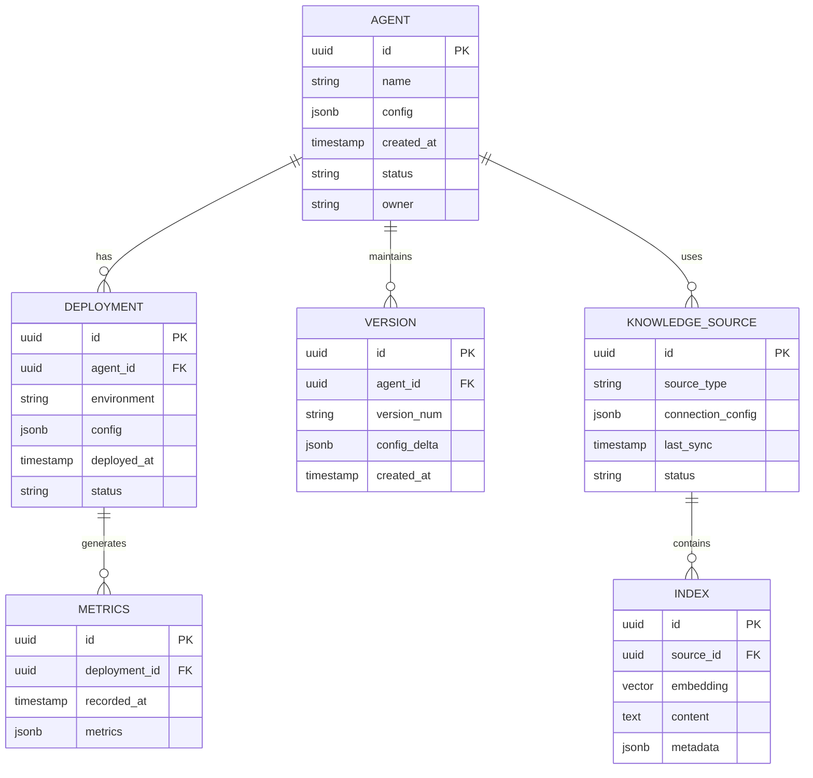
```mermaid
erDiagram
    AGENT ||--o{ DEPLOYMENT : has
    AGENT ||--o{ VERSION : maintains
    AGENT ||--o{ KNOWLEDGE_SOURCE : uses
    DEPLOYMENT ||--o{ METRICS : generates
    KNOWLEDGE_SOURCE ||--o{ INDEX : contains

    AGENT {
        uuid id PK
        string name
        jsonb config
        timestamp created_at
        string status
        string owner
    }

    DEPLOYMENT {
        uuid id PK
        uuid agent_id FK
        string environment
        jsonb config
        timestamp deployed_at
        string status
    }

    VERSION {
        uuid id PK
        uuid agent_id FK
        string version_num
        jsonb config_delta
        timestamp created_at
    }

    KNOWLEDGE_SOURCE {
        uuid id PK
        string source_type
        jsonb connection_config
        timestamp last_sync
        string status
    }

    INDEX {
        uuid id PK
        uuid source_id FK
        vector embedding
        text content
        jsonb metadata
    }

    METRICS {
        uuid id PK
        uuid deployment_id FK
        timestamp recorded_at
        jsonb metrics
    }
```

### 3.2.2 Data Management Strategy

| Aspect | Strategy | Implementation |
|--------|----------|----------------|
| Versioning | Temporal Tables | PostgreSQL temporal tables with version history |
| Archival | Time-based | 90-day active retention, archive to S3 |
| Backup | Continuous | Point-in-time recovery with 35-day window |
| Privacy | Column-level | Encryption for sensitive fields, masking for PII |
| Audit | CDC Streams | DynamoDB Streams to CloudWatch Logs |

### 3.2.3 Performance Optimization

| Component | Strategy | Details |
|-----------|----------|----------|
| Indexes | Partial + Covering | Optimized for common query patterns |
| Caching | Multi-level | Application cache + DAX + CloudFront |
| Scaling | Auto-scaling | DynamoDB on-demand, RDS Aurora Serverless |
| Partitioning | Time-based | Monthly partitions for metrics data |
| Replication | Multi-AZ | Synchronous replication for high availability |

## 3.3 API DESIGN

### 3.3.1 API Architecture

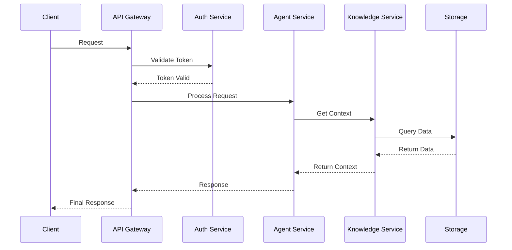
```mermaid
sequenceDiagram
    participant Client
    participant API Gateway
    participant Auth Service
    participant Agent Service
    participant Knowledge Service
    participant Storage

    Client->>API Gateway: Request
    API Gateway->>Auth Service: Validate Token
    Auth Service-->>API Gateway: Token Valid
    API Gateway->>Agent Service: Process Request
    Agent Service->>Knowledge Service: Get Context
    Knowledge Service->>Storage: Query Data
    Storage-->>Knowledge Service: Return Data
    Knowledge Service-->>Agent Service: Return Context
    Agent Service-->>API Gateway: Response
    API Gateway-->>Client: Final Response
```

### 3.3.2 API Specifications

| Endpoint | Method | Purpose | Auth Level |
|----------|--------|---------|------------|
| /agents | GET | List agents | User |
| /agents/{id} | GET | Get agent details | User |
| /agents | POST | Create agent | Power User |
| /agents/{id}/deploy | POST | Deploy agent | Admin |
| /knowledge/sources | GET | List sources | User |
| /knowledge/query | POST | Query knowledge | User |

### 3.3.3 Integration Patterns

| Pattern | Implementation | Purpose |
|---------|----------------|---------|
| Circuit Breaker | AWS App Mesh | Service resilience |
| Rate Limiting | API Gateway | Resource protection |
| Throttling | Token bucket | Load management |
| Service Discovery | AWS Cloud Map | Dynamic service location |
| Authentication | Cognito + JWT | Identity management |
| Authorization | IAM + Custom Rules | Access control |

# 4. TECHNOLOGY STACK

## 4.1 PROGRAMMING LANGUAGES

| Platform/Component | Language | Version | Justification |
|-------------------|----------|---------|---------------|
| Backend Services | Python | 3.11+ | RAG processing capabilities, AI/ML library ecosystem, enterprise integration support |
| Frontend Web | TypeScript | 5.0+ | Type safety, enterprise-scale maintainability, React ecosystem compatibility |
| Infrastructure | Go | 1.21+ | High-performance agent communication, efficient system services |
| Data Processing | Python | 3.11+ | Data science libraries, Snowflake integration, ETL capabilities |
| CLI Tools | Python | 3.11+ | Consistency with backend, cross-platform support |

## 4.2 FRAMEWORKS & LIBRARIES

### Core Frameworks

| Category | Framework | Version | Purpose |
|----------|-----------|---------|----------|
| Backend API | FastAPI | 0.104+ | High-performance async API support, automatic OpenAPI documentation |
| Frontend Web | React | 18.2+ | Component reusability, enterprise UI development |
| AI/ML | LangChain | 0.1.0+ | RAG implementation, AI model orchestration |
| State Management | Redux Toolkit | 2.0+ | Predictable state management, enterprise scalability |
| UI Components | AWS Amplify UI | 6.0+ | AWS service integration, consistent enterprise styling |

### Supporting Libraries

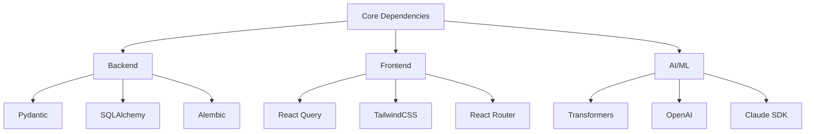
```mermaid
graph TD
    A[Core Dependencies] --> B[Backend]
    A --> C[Frontend]
    A --> D[AI/ML]
    
    B --> B1[Pydantic]
    B --> B2[SQLAlchemy]
    B --> B3[Alembic]
    
    C --> C1[React Query]
    C --> C2[TailwindCSS]
    C --> C3[React Router]
    
    D --> D1[Transformers]
    D --> D2[OpenAI]
    D --> D3[Claude SDK]
```

## 4.3 DATABASES & STORAGE

### Primary Data Stores

| Type | Technology | Version | Use Case |
|------|------------|---------|----------|
| Document Store | DynamoDB | Latest | Agent configurations, user data |
| Search Engine | OpenSearch | 2.9+ | Knowledge base indexing, RAG storage |
| Object Storage | S3 | Latest | Document storage, model artifacts |
| Cache | ElastiCache Redis | 7.0+ | Session data, frequent queries |
| RDBMS | Aurora PostgreSQL | 15+ | Transactional data, audit logs |

### Data Flow Architecture

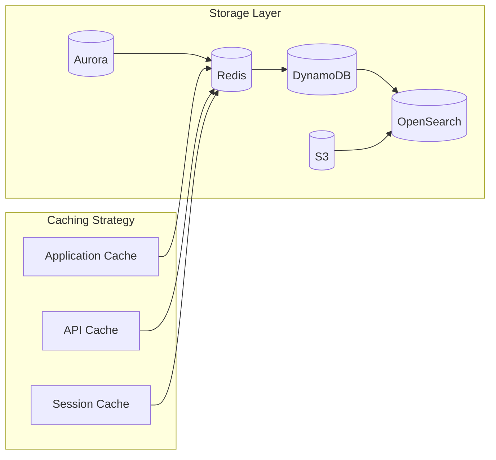
```mermaid
flowchart LR
    subgraph Storage Layer
        A[(DynamoDB)] --> B[(OpenSearch)]
        C[(S3)] --> B
        D[(Redis)] --> A
        E[(Aurora)] --> D
    end
    
    subgraph Caching Strategy
        F[Application Cache] --> D
        G[API Cache] --> D
        H[Session Cache] --> D
    end
```

## 4.4 THIRD-PARTY SERVICES

| Category | Service | Integration Method | Purpose |
|----------|---------|-------------------|----------|
| AI Models | OpenAI | REST API | GPT-4 integration |
| AI Models | Anthropic | REST API | Claude integration |
| AI Models | AWS Bedrock | SDK | Foundation models |
| Auth | AWS Cognito | SDK | Authentication/Authorization |
| Monitoring | DataDog | Agent | Application monitoring |
| APM | AWS X-Ray | SDK | Distributed tracing |
| Enterprise | Mavenlink | REST API | Project data |
| Enterprise | Lever | REST API | Recruitment data |
| Enterprise | Rippling | REST API | HR operations |

## 4.5 DEVELOPMENT & DEPLOYMENT

### Development Environment

| Tool | Version | Purpose |
|------|---------|----------|
| VS Code | Latest | Primary IDE |
| PyCharm | 2023.2+ | Python development |
| Docker Desktop | Latest | Local containerization |
| AWS CDK | 2.0+ | Infrastructure as code |
| Git | Latest | Version control |

### Deployment Pipeline

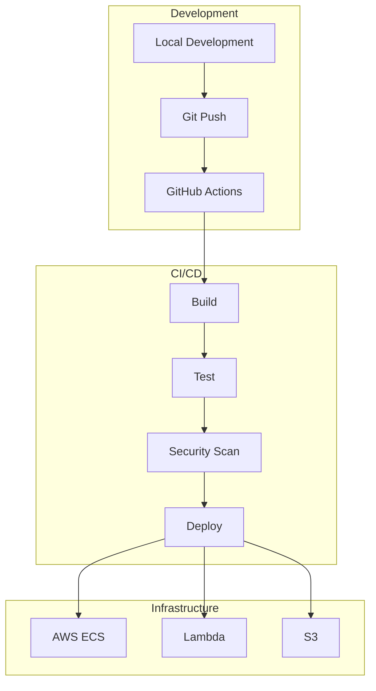
```mermaid
graph TD
    subgraph Development
        A[Local Development] --> B[Git Push]
        B --> C[GitHub Actions]
    end
    
    subgraph CI/CD
        C --> D[Build]
        D --> E[Test]
        E --> F[Security Scan]
        F --> G[Deploy]
    end
    
    subgraph Infrastructure
        G --> H[AWS ECS]
        G --> I[Lambda]
        G --> J[S3]
    end
```

### Containerization Strategy

| Component | Base Image | Purpose |
|-----------|------------|----------|
| API Services | python:3.11-slim | Backend services |
| UI | node:18-alpine | Frontend applications |
| Agent Runtime | python:3.11-slim | Agent execution |
| Workers | python:3.11-slim | Background processing |

### Build and Deploy Requirements

| Requirement | Tool/Service | Configuration |
|-------------|--------------|---------------|
| Infrastructure | AWS CDK | TypeScript |
| Containers | Docker | Multi-stage builds |
| CI/CD | GitHub Actions | Workflow per environment |
| Monitoring | AWS CloudWatch | Custom metrics |
| Security | AWS KMS | Encryption management |
| Networking | AWS VPC | Private subnets |

# 5. SYSTEM DESIGN

## 5.1 USER INTERFACE DESIGN

### 5.1.1 Main Navigation Structure

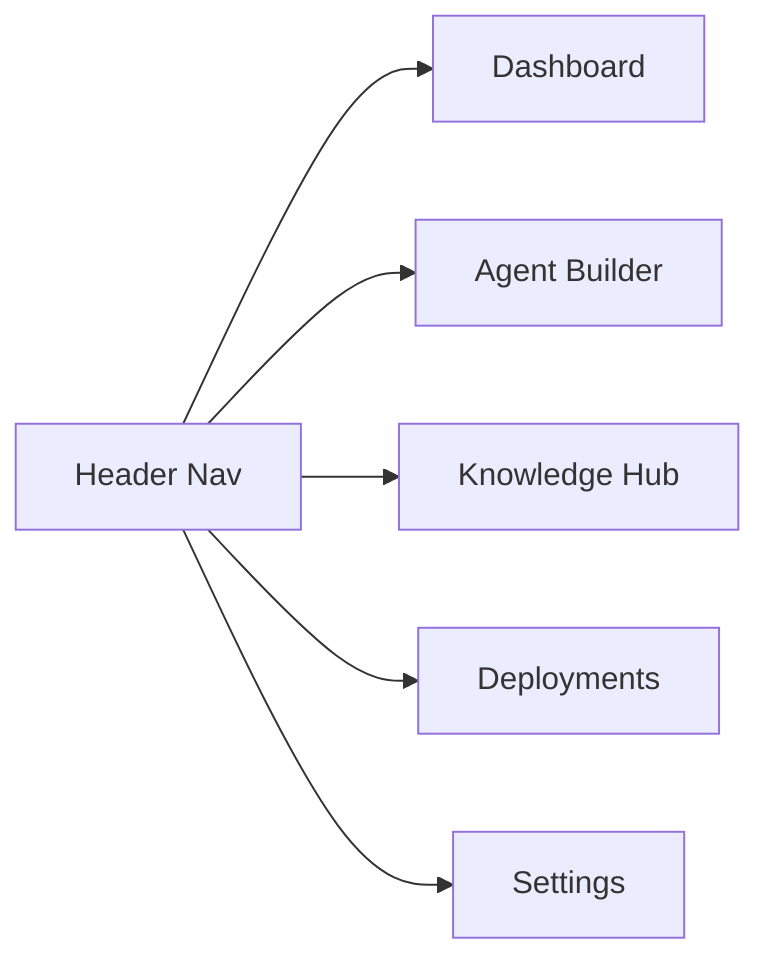
```mermaid
graph LR
    A[Header Nav] --> B[Dashboard]
    A --> C[Agent Builder]
    A --> D[Knowledge Hub]
    A --> E[Deployments]
    A --> F[Settings]
```

### 5.1.2 Agent Builder Interface Layout

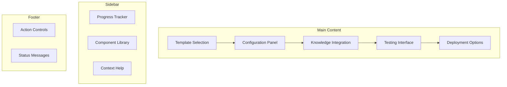
```mermaid
graph TB
    subgraph Main Content
        A[Template Selection] --> B[Configuration Panel]
        B --> C[Knowledge Integration]
        C --> D[Testing Interface]
        D --> E[Deployment Options]
    end
    
    subgraph Sidebar
        F[Progress Tracker]
        G[Component Library]
        H[Context Help]
    end
    
    subgraph Footer
        I[Action Controls]
        J[Status Messages]
    end
```

### 5.1.3 Component Specifications

| Component | Description | Interaction Pattern |
|-----------|-------------|-------------------|
| Template Gallery | Card-based grid with filtering | Click to select, hover for preview |
| Configuration Editor | Split-pane JSON/Form editor | Real-time validation |
| Knowledge Connector | Drag-drop interface for sources | Visual connection status |
| Test Console | Interactive chat/command interface | Real-time response testing |
| Deployment Panel | Environment selection matrix | One-click deployment |

## 5.2 DATABASE DESIGN

### 5.2.1 Core Schema

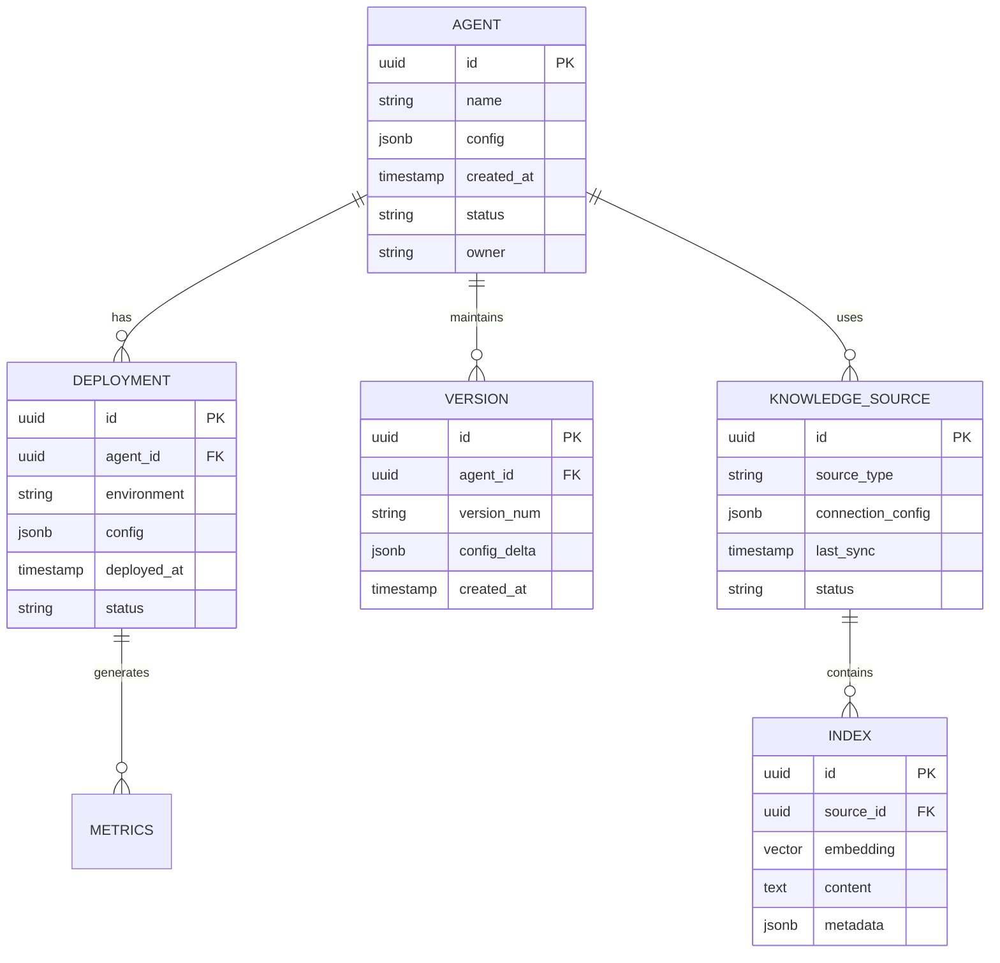
```mermaid
erDiagram
    AGENT ||--o{ DEPLOYMENT : has
    AGENT ||--o{ VERSION : maintains
    AGENT ||--o{ KNOWLEDGE_SOURCE : uses
    DEPLOYMENT ||--o{ METRICS : generates
    KNOWLEDGE_SOURCE ||--o{ INDEX : contains

    AGENT {
        uuid id PK
        string name
        jsonb config
        timestamp created_at
        string status
        string owner
    }

    DEPLOYMENT {
        uuid id PK
        uuid agent_id FK
        string environment
        jsonb config
        timestamp deployed_at
        string status
    }

    VERSION {
        uuid id PK
        uuid agent_id FK
        string version_num
        jsonb config_delta
        timestamp created_at
    }

    KNOWLEDGE_SOURCE {
        uuid id PK
        string source_type
        jsonb connection_config
        timestamp last_sync
        string status
    }

    INDEX {
        uuid id PK
        uuid source_id FK
        vector embedding
        text content
        jsonb metadata
    }
```

### 5.2.2 Storage Strategy

| Data Type | Storage Solution | Justification |
|-----------|-----------------|---------------|
| Agent Configurations | DynamoDB | Fast access, flexible schema |
| Knowledge Vectors | OpenSearch | Vector search capabilities |
| Deployment Artifacts | S3 | Scalable binary storage |
| Operational Metrics | TimescaleDB | Time-series optimization |
| User Sessions | Redis | In-memory performance |

## 5.3 API DESIGN

### 5.3.1 Core API Structure

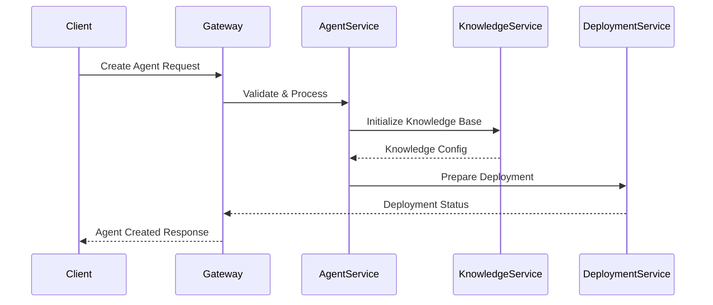
```mermaid
sequenceDiagram
    participant Client
    participant Gateway
    participant AgentService
    participant KnowledgeService
    participant DeploymentService

    Client->>Gateway: Create Agent Request
    Gateway->>AgentService: Validate & Process
    AgentService->>KnowledgeService: Initialize Knowledge Base
    KnowledgeService-->>AgentService: Knowledge Config
    AgentService->>DeploymentService: Prepare Deployment
    DeploymentService-->>Gateway: Deployment Status
    Gateway-->>Client: Agent Created Response
```

### 5.3.2 API Endpoints

| Endpoint | Method | Purpose | Request Format |
|----------|--------|---------|----------------|
| /agents | POST | Create new agent | JSON configuration |
| /agents/{id} | GET | Retrieve agent details | Path parameter |
| /agents/{id}/deploy | POST | Deploy agent | Environment config |
| /knowledge/sources | GET | List knowledge sources | Query parameters |
| /knowledge/query | POST | Query knowledge base | RAG parameters |

### 5.3.3 Integration Patterns

| Pattern | Implementation | Use Case |
|---------|----------------|----------|
| Event Sourcing | EventBridge | Agent state changes |
| CQRS | DynamoDB Streams | Configuration updates |
| Circuit Breaker | AWS App Mesh | External service calls |
| Message Queue | SQS | Async processing |
| Pub/Sub | SNS | Deployment notifications |

### 5.3.4 Authentication Flow

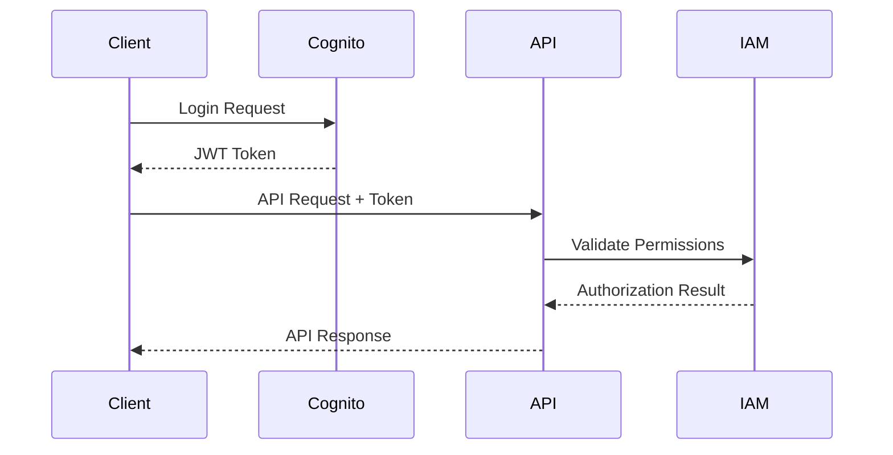
```mermaid
sequenceDiagram
    participant Client
    participant Cognito
    participant API
    participant IAM

    Client->>Cognito: Login Request
    Cognito-->>Client: JWT Token
    Client->>API: API Request + Token
    API->>IAM: Validate Permissions
    IAM-->>API: Authorization Result
    API-->>Client: API Response
```

# 6. USER INTERFACE DESIGN

## 6.1 Design System

The Agent Builder Hub interface follows AWS Amplify UI design patterns with Material Design 3.0 principles, implementing a responsive layout supporting desktop (1440px), laptop (1024px), and tablet (768px) breakpoints.

### Icon & Symbol Key
```
Navigation & Actions:
[#] - Dashboard/Menu
[+] - Create New
[x] - Close/Delete
[<] [>] - Navigation
[=] - Settings Menu
[@] - User Profile
[?] - Help/Documentation
[!] - Warning/Alert
[^] - Upload/Import
[*] - Favorite/Important
[i] - Information

Input Elements:
[ ] - Checkbox
( ) - Radio Button
[...] - Text Input
[v] - Dropdown Menu
[Button] - Action Button
[====] - Progress Bar
```

## 6.2 Main Navigation Layout
```
+----------------------------------------------------------+
|  [#] Agent Builder Hub                [@] Profile  [?] Help|
+----------------------------------------------------------+
|                                                           |
|  [=] Menu    [*] Favorites    [!] Notifications           |
|                                                           |
|  +------------------+  +-------------------------+        |
|  | Quick Actions    |  | Recent Agents           |        |
|  | [+] New Agent    |  | > BI Migration Agent    |        |
|  | [^] Import       |  | > HR Onboarding Bot     |        |
|  | [*] Templates    |  | > Data Modeling Agent   |        |
|  +------------------+  +-------------------------+        |
|                                                           |
|  [====================================] 75% Platform Usage|
+----------------------------------------------------------+
```

## 6.3 Agent Creation Wizard
```
+----------------------------------------------------------+
| [<] Back    Create New Agent                    Step 1 of 4|
+----------------------------------------------------------+
|                                                           |
|  Select Agent Type:                                       |
|  ( ) Streamlit Application                                |
|  ( ) Slack Integration                                    |
|  ( ) AWS React App                                       |
|  ( ) Standalone Agent                                    |
|                                                           |
|  Template Selection:                                      |
|  [v] Choose Template                                      |
|  +------------------------+                               |
|  | > BI Migration        |                               |
|  | > Data Modeling       |                               |
|  | > Process Automation  |                               |
|  +------------------------+                               |
|                                                           |
|  [Cancel]                                    [Next >]     |
+----------------------------------------------------------+
```

## 6.4 Knowledge Integration Panel
```
+----------------------------------------------------------+
| Knowledge Source Configuration                    [?]      |
+----------------------------------------------------------+
|                                                           |
|  Connected Sources:                                       |
|  [x] Confluence     [====] Indexed                        |
|  [x] Docebo        [======] Syncing                      |
|  [x] Mavenlink     [====] Indexed                        |
|                                                           |
|  Add New Source:                                          |
|  [+] Enterprise System                                    |
|  [+] Document Repository                                  |
|  [+] Custom Integration                                   |
|                                                           |
|  Index Status:                                            |
|  [====================] 100% Complete                     |
|  Last Updated: 2024-02-20 14:30 UTC                      |
|                                                           |
|  [Refresh Index]                              [Save]      |
+----------------------------------------------------------+
```

## 6.5 Agent Testing Console
```
+----------------------------------------------------------+
| Agent Testing Environment                        [i]       |
+----------------------------------------------------------+
|  Agent: BI Migration Assistant v1.2                       |
|  +----------------------+  +-------------------------+     |
|  | Input Parameters:    |  | Response Preview:       |     |
|  | [...................]|  | > Analyzing reports...  |     |
|  | [...................]|  | > Found 142 duplicates  |     |
|  | [Test Input]        |  | > Generating plan...    |     |
|  +----------------------+  +-------------------------+     |
|                                                           |
|  Debug Information:                                       |
|  +--------------------------------------------------+    |
|  | [!] Warning: Rate limit at 80%                    |    |
|  | [i] Knowledge base access: 24ms                   |    |
|  | [i] Model response time: 1.2s                     |    |
|  +--------------------------------------------------+    |
|                                                           |
|  [Reset]  [Save Test Case]            [Deploy Agent >]    |
+----------------------------------------------------------+
```

## 6.6 Deployment Dashboard
```
+----------------------------------------------------------+
| Active Deployments                              [@] Admin  |
+----------------------------------------------------------+
|                                                           |
|  Environment: [v] Production                              |
|                                                           |
|  +---------------------------------------------------+   |
|  | Agent Name    | Status  | Health | Last Active     |   |
|  |--------------|---------|--------|------------------|   |
|  | BI Copilot   | [====]  | [*]    | 2 mins ago      |   |
|  | HR Assistant | [====]  | [*]    | 14 mins ago     |   |
|  | Data Modeler | [===]   | [!]    | 1 hour ago      |   |
|  +---------------------------------------------------+   |
|                                                           |
|  System Health:                                           |
|  CPU: [=========] 90%                                     |
|  Memory: [======] 60%                                     |
|  API Calls: [====] 40%                                    |
|                                                           |
|  [Refresh]                              [New Deployment]  |
+----------------------------------------------------------+
```

## 6.7 Responsive Behavior

The interface implements responsive breakpoints:

Desktop (1440px+):
- Full feature visibility
- Multi-column layouts
- Expanded navigation

Laptop (1024px):
- Condensed navigation
- Scrollable panels
- Maintained functionality

Tablet (768px):
- Single column layouts
- Collapsible sections
- Touch-optimized controls

## 6.8 Accessibility Features

- WCAG 2.1 Level AA compliance
- Keyboard navigation support
- Screen reader compatibility
- High contrast mode support
- Focus indicators
- Semantic HTML structure
- ARIA labels and landmarks
- Reduced motion options

# 7. SECURITY CONSIDERATIONS

## 7.1 AUTHENTICATION AND AUTHORIZATION

### 7.1.1 Authentication Flow

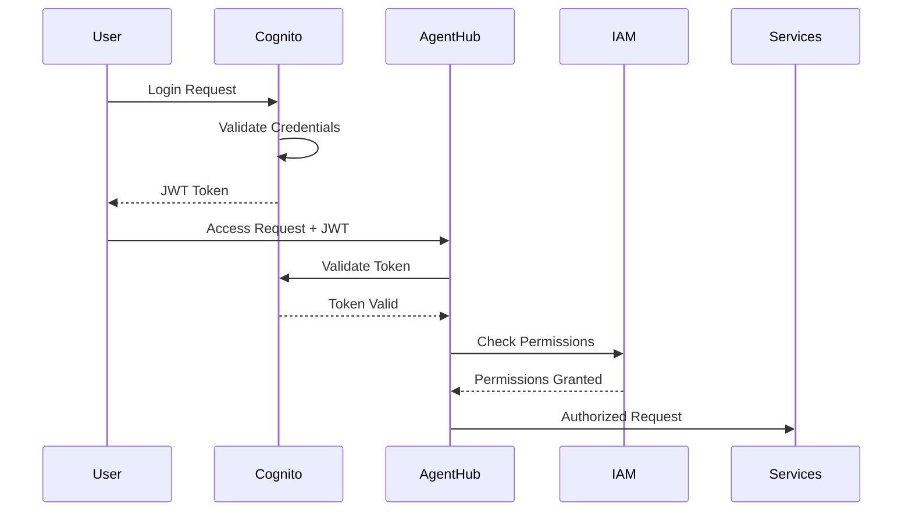
```mermaid
sequenceDiagram
    participant User
    participant Cognito
    participant AgentHub
    participant IAM
    participant Services

    User->>Cognito: Login Request
    Cognito->>Cognito: Validate Credentials
    Cognito-->>User: JWT Token
    User->>AgentHub: Access Request + JWT
    AgentHub->>Cognito: Validate Token
    Cognito-->>AgentHub: Token Valid
    AgentHub->>IAM: Check Permissions
    IAM-->>AgentHub: Permissions Granted
    AgentHub->>Services: Authorized Request
```

### 7.1.2 Access Control Matrix

| Role | Agent Creation | Knowledge Base Access | Deployment | Admin Functions |
|------|---------------|----------------------|------------|-----------------|
| Admin | Full Access | Full Access | Full Access | Full Access |
| Power User | Create/Edit/Delete | Read/Write | Dev/Test/Prod | Limited |
| Developer | Create/Edit | Read/Write | Dev/Test | None |
| Business User | Create from Template | Read | Dev Only | None |
| Viewer | View Only | Read | None | None |

## 7.2 DATA SECURITY

### 7.2.1 Encryption Standards

| Data State | Method | Key Management |
|------------|--------|----------------|
| At Rest | AES-256 | AWS KMS |
| In Transit | TLS 1.3 | ACM Certificates |
| Database | Field-level | AWS KMS |
| Secrets | AWS Secrets Manager | Automatic Rotation |
| Backups | AES-256 | Cross-Region Keys |

### 7.2.2 Data Classification

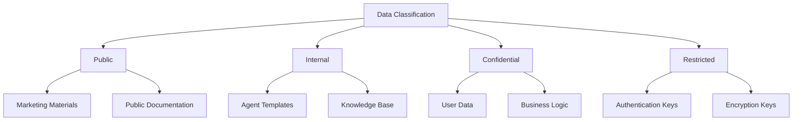
```mermaid
graph TD
    A[Data Classification] --> B[Public]
    A --> C[Internal]
    A --> D[Confidential]
    A --> E[Restricted]

    B --> B1[Marketing Materials]
    B --> B2[Public Documentation]

    C --> C1[Agent Templates]
    C --> C2[Knowledge Base]

    D --> D1[User Data]
    D --> D2[Business Logic]

    E --> E1[Authentication Keys]
    E --> E2[Encryption Keys]
```

## 7.3 SECURITY PROTOCOLS

### 7.3.1 Network Security

| Layer | Protection Measure | Implementation |
|-------|-------------------|----------------|
| Edge | AWS WAF | SQL injection, XSS prevention |
| Network | Security Groups | Port/protocol restrictions |
| Application | API Gateway | Request throttling, validation |
| VPC | Network ACLs | Subnet isolation |
| Endpoints | PrivateLink | Secure service access |

### 7.3.2 Security Monitoring

```mermaid
flowchart LR
    subgraph Detection
        A[GuardDuty] --> B[Security Hub]
        C[CloudTrail] --> B
        D[Config] --> B
    end

    subgraph Response
        B --> E[EventBridge]
        E --> F[Lambda]
        F --> G[SNS]
    end

    subgraph Notification
        G --> H[Security Team]
        G --> I[Automated Response]
    end
```

### 7.3.3 Compliance Controls

| Requirement | Implementation | Monitoring |
|-------------|----------------|------------|
| SOC 2 | AWS Config Rules | Continuous |
| GDPR | Data Encryption | Daily Scans |
| HIPAA | Access Controls | Real-time |
| ISO 27001 | Security Policies | Weekly Audit |
| PCI DSS | Network Isolation | Monthly Review |

### 7.3.4 Security Update Process

```mermaid
stateDiagram-v2
    [*] --> SecurityAlert
    SecurityAlert --> RiskAssessment
    RiskAssessment --> Planning
    Planning --> Testing
    Testing --> Deployment
    Deployment --> Verification
    Verification --> Documentation
    Documentation --> [*]

    Testing --> RiskAssessment: Failed
    Verification --> Testing: Failed
```

### 7.3.5 Incident Response

| Phase | Actions | Responsible Team |
|-------|---------|-----------------|
| Detection | Automated monitoring alerts | Security Operations |
| Analysis | Threat assessment, scope determination | Security Team |
| Containment | System isolation, access restriction | Operations Team |
| Eradication | Vulnerability patching, system hardening | Engineering Team |
| Recovery | Service restoration, data validation | Operations Team |
| Lessons Learned | Incident documentation, process improvement | Security Team |

# 8. INFRASTRUCTURE

## 8.1 DEPLOYMENT ENVIRONMENT

The Agent Builder Hub will be deployed entirely within AWS cloud infrastructure, leveraging a multi-account strategy for separation of concerns and security isolation.

| Account Type | Purpose | Key Components |
|-------------|----------|----------------|
| Development | Development and testing | Development workloads, test data |
| Staging | Pre-production validation | Production mirror, integration testing |
| Production | Live system operation | Customer workloads, production data |
| Security | Security and audit | Security tools, audit logs |
| Shared Services | Common resources | Networking, DNS, Active Directory |

### Environment Architecture

```mermaid
graph TB
    subgraph AWS Cloud
        subgraph Production Account
            A[VPC] --> B[Public Subnets]
            A --> C[Private Subnets]
            A --> D[Isolated Subnets]
            
            B --> E[ALB]
            C --> F[ECS Clusters]
            C --> G[Lambda Functions]
            D --> H[RDS/DynamoDB]
        end
        
        subgraph Shared Services
            I[Transit Gateway]
            J[Route 53]
            K[AWS Directory Service]
        end
        
        subgraph Security Account
            L[Security Hub]
            M[GuardDuty]
            N[AWS Audit Manager]
        end
    end
```

## 8.2 CLOUD SERVICES

| Service Category | AWS Service | Purpose | Justification |
|-----------------|-------------|----------|---------------|
| Compute | ECS Fargate | Container hosting | Serverless container management |
| Compute | Lambda | Serverless functions | Event-driven processing |
| Storage | S3 | Object storage | Scalable artifact storage |
| Database | DynamoDB | NoSQL database | High-performance agent data |
| Database | Aurora PostgreSQL | Relational database | Transactional data |
| Search | OpenSearch | Search/Analytics | Knowledge base indexing |
| Networking | VPC | Network isolation | Security boundaries |
| Security | WAF | Web application firewall | Attack protection |
| Monitoring | CloudWatch | Monitoring/Logging | Centralized observability |
| Identity | Cognito | Authentication | User management |

## 8.3 CONTAINERIZATION

### Container Strategy

```mermaid
graph LR
    subgraph Base Images
        A[Python 3.11 Slim] --> B[Agent Runtime]
        C[Node 18 Alpine] --> D[UI Services]
    end
    
    subgraph Container Types
        B --> E[Agent Containers]
        B --> F[API Services]
        D --> G[Web Interface]
    end
    
    subgraph Registry
        H[ECR Private]
        E & F & G --> H
    end
```

### Container Specifications

| Container Type | Base Image | Memory Limit | CPU Limit | Scaling Strategy |
|---------------|------------|--------------|-----------|------------------|
| Agent Runtime | python:3.11-slim | 2GB | 1 vCPU | Horizontal |
| API Services | python:3.11-slim | 4GB | 2 vCPU | Horizontal |
| Web Interface | node:18-alpine | 1GB | 0.5 vCPU | Horizontal |
| Workers | python:3.11-slim | 2GB | 1 vCPU | Horizontal |

## 8.4 ORCHESTRATION

The system uses AWS ECS with Fargate for container orchestration, providing serverless container management.

### Orchestration Architecture

```mermaid
graph TB
    subgraph ECS Cluster
        A[Service Discovery] --> B[Task Definitions]
        B --> C[Services]
        C --> D[Tasks]
        
        subgraph Services
            E[Agent Service]
            F[API Service]
            G[Web Service]
        end
        
        subgraph Auto Scaling
            H[Target Tracking]
            I[Step Scaling]
        end
        
        C --> H & I
    end
```

### Service Configuration

| Service Type | Min Tasks | Max Tasks | CPU | Memory | Auto Scaling Metric |
|-------------|-----------|-----------|-----|---------|-------------------|
| Agent Service | 2 | 20 | 1 vCPU | 2GB | CPU Utilization |
| API Service | 3 | 30 | 2 vCPU | 4GB | Request Count |
| Web Service | 2 | 10 | 0.5 vCPU | 1GB | CPU Utilization |

## 8.5 CI/CD PIPELINE

### Pipeline Architecture

```mermaid
graph LR
    subgraph Source
        A[GitHub Repository]
    end
    
    subgraph CI Pipeline
        B[GitHub Actions]
        C[Unit Tests]
        D[Integration Tests]
        E[Security Scan]
        F[Build Images]
    end
    
    subgraph CD Pipeline
        G[AWS CodeDeploy]
        H[Staging Deploy]
        I[Production Deploy]
    end
    
    A --> B
    B --> C
    C --> D
    D --> E
    E --> F
    F --> G
    G --> H
    H --> I
```

### Pipeline Stages

| Stage | Tool | Purpose | SLA |
|-------|------|---------|-----|
| Source Control | GitHub | Code versioning | < 1 min |
| Build | GitHub Actions | Compilation/packaging | < 5 min |
| Test | PyTest/Jest | Automated testing | < 10 min |
| Security Scan | SonarQube | Code quality/security | < 5 min |
| Image Build | Docker | Container creation | < 5 min |
| Deploy Staging | CodeDeploy | Staging verification | < 10 min |
| Deploy Production | CodeDeploy | Production release | < 15 min |

### Deployment Strategy

| Environment | Strategy | Rollback Time | Health Checks |
|-------------|----------|---------------|---------------|
| Development | Direct Push | Immediate | Basic |
| Staging | Blue/Green | < 5 min | Comprehensive |
| Production | Blue/Green | < 5 min | Comprehensive |

# 8. APPENDICES

## 8.1 ADDITIONAL TECHNICAL INFORMATION

### 8.1.1 Agent Communication Patterns

```mermaid
flowchart LR
    subgraph Agent Communication
        A[Agent A] -->|Task Request| B[Agent B]
        B -->|Status Update| A
        A -->|Knowledge Query| C[Knowledge Base]
        B -->|Knowledge Query| C
        D[Orchestrator] -->|Control| A
        D -->|Control| B
        E[Monitor] -->|Metrics| D
    end
```

### 8.1.2 Supported Migration Patterns

| Source System | Target System | Migration Components |
|--------------|---------------|---------------------|
| SQL Server | Snowflake | Schema conversion, Data migration, Security mapping |
| Tableau | Sigma | Report analysis, Dashboard conversion, User mapping |
| PowerBI | Sigma | Visual translation, Data model migration, Security roles |
| Cognos | Sigma | Report rationalization, Metadata mapping, Access control |
| SAP | Snowflake | Data model conversion, ETL pipeline, Integration points |

### 8.1.3 Knowledge Base Integration Methods

| Source | Integration Method | Update Frequency | Indexing Strategy |
|--------|-------------------|------------------|-------------------|
| Confluence | REST API + Webhook | Real-time | Incremental |
| Docebo | REST API | Daily | Full refresh |
| Internal Repos | Git hooks | On commit | Differential |
| Process Docs | File system | Hourly | Incremental |
| Training Materials | API polling | Weekly | Full refresh |

## 8.2 GLOSSARY

| Term | Definition |
|------|------------|
| Agent Builder Hub | Central platform for creating and managing AI-powered automation agents |
| Copilot | AI assistant designed to augment human work in specific domains |
| Data Vault | Database modeling methodology for enterprise data warehouses |
| Report Rationalization | Process of analyzing and consolidating redundant reports |
| Value Pool | Collection of domain-specific knowledge and best practices |
| RAG Processing | Retrieval Augmented Generation for context-aware AI responses |
| Knowledge Integration | Process of connecting and indexing enterprise knowledge sources |
| Agent Orchestration | Management and coordination of multiple AI agents |
| Template Library | Collection of pre-configured agent patterns |
| Component Repository | Storage system for reusable agent components |
| Deployment Pipeline | Automated process for agent deployment and updates |
| Enterprise Integration | Connection to corporate systems and data sources |

## 8.3 ACRONYMS

| Acronym | Full Form |
|---------|-----------|
| API | Application Programming Interface |
| AWS | Amazon Web Services |
| BI | Business Intelligence |
| CDK | Cloud Development Kit |
| DAX | DynamoDB Accelerator |
| DBT | Data Build Tool |
| ECS | Elastic Container Service |
| ETL | Extract, Transform, Load |
| IAM | Identity and Access Management |
| JWT | JSON Web Token |
| KMS | Key Management Service |
| NACL | Network Access Control List |
| RAG | Retrieval Augmented Generation |
| REST | Representational State Transfer |
| SDK | Software Development Kit |
| SLA | Service Level Agreement |
| SSO | Single Sign-On |
| VPC | Virtual Private Cloud |
| WAF | Web Application Firewall |
| WCAG | Web Content Accessibility Guidelines |

## 8.4 REFERENCE ARCHITECTURE

```mermaid
C4Context
    title Reference Architecture - Agent Builder Hub

    Person(user, "Enterprise User", "Creates and manages agents")
    
    System_Boundary(hub, "Agent Builder Hub") {
        System(builder, "Agent Builder", "Core agent creation interface")
        System(orch, "Orchestrator", "Agent management and coordination")
        System(repo, "Repository", "Component and code storage")
        System(know, "Knowledge Service", "Enterprise knowledge integration")
    }
    
    System_Ext(aws, "AWS Services", "Cloud infrastructure")
    System_Ext(ai, "AI Models", "Language models and services")
    System_Ext(ent, "Enterprise Systems", "Internal business systems")
    
    Rel(user, builder, "Creates agents")
    Rel(builder, orch, "Deploys agents")
    Rel(orch, repo, "Stores/retrieves")
    Rel(orch, know, "Queries knowledge")
    Rel(know, ent, "Integrates data")
    Rel(orch, aws, "Deploys to")
    Rel(orch, ai, "Utilizes")
```