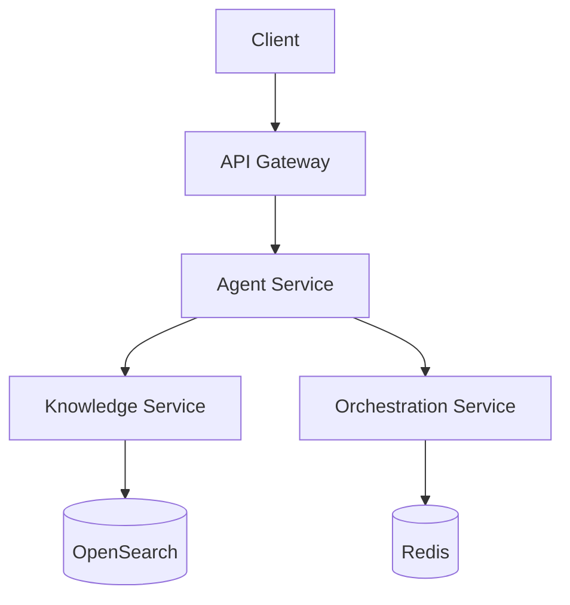

# Agent Builder Hub - Backend Services

[](https://github.com/hakkoda/agent-builder-hub/actions)
[](https://codecov.io/gh/hakkoda/agent-builder-hub)

[](https://snyk.io/test/github/hakkoda/agent-builder-hub)

Enterprise-grade backend services for the Agent Builder Hub platform, enabling AI-powered automation solution creation and management.

## Overview

The Agent Builder Hub backend services provide the core infrastructure for creating, managing, and deploying AI agents across the enterprise. Built with Python 3.11+ and leveraging AWS services, these services implement:

- RAG (Retrieval Augmented Generation) processing capabilities
- Enterprise system integrations (Mavenlink, Lever, Rippling)
- Secure agent deployment and orchestration
- Knowledge base management and indexing
- Real-time monitoring and observability

## Prerequisites

### Required Software
- Python 3.11+
- Docker Desktop 4.0+
- AWS CLI v2
- Git 2.0+

### Development Tools
- VS Code or PyCharm Professional 2023.2+
- Docker Desktop
- AWS CDK 2.0+
- PostgreSQL 15+ (local development)

### Access Requirements
- AWS IAM credentials with appropriate permissions
- Hakkoda enterprise SSO access
- Required API keys for integrated services

## Getting Started

### Environment Setup

1. Clone the repository and configure access:
```bash
git clone https://github.com/hakkoda/agent-builder-hub.git
cd agent-builder-hub/src/backend
```

2. Copy and configure environment variables:
```bash
cp .env.example .env
# Edit .env with required credentials and configurations
```

3. Create and activate a virtual environment:
```bash
python -m venv venv
source venv/bin/activate  # Unix
.\venv\Scripts\activate   # Windows
```

4. Install dependencies:
```bash
pip install -e ".[dev]"
```

### Local Development

1. Start required services:
```bash
docker-compose up -d
```

2. Initialize the database:
```bash
python manage.py db upgrade
```

3. Start the development server:
```bash
python manage.py runserver
```

4. Run tests:
```bash
pytest
```

## Architecture

### Service Components
- Agent Service (FastAPI)
- Knowledge Service (FastAPI + OpenSearch)
- Orchestration Service (FastAPI + Redis)
- Authentication Service (Cognito + Custom Middleware)

### Data Flow


## Security

### Authentication
- AWS Cognito user pools
- JWT token validation
- Role-based access control

### Authorization
- Fine-grained IAM policies
- Resource-level permissions
- Audit logging

### Data Protection
- AES-256 encryption at rest
- TLS 1.3 in transit
- AWS KMS key management

## Deployment

### Container Build

Build optimized Docker images:
```bash
docker build -t agent-builder-backend:latest .
```

Image specifications:
- Base: python:3.11-slim
- Memory: 2GB limit
- CPU: 1 vCPU
- Port: 8000

### AWS Deployment

1. Configure AWS credentials:
```bash
aws configure
```

2. Deploy infrastructure:
```bash
cdk deploy
```

3. Verify deployment:
```bash
aws ecs list-services --cluster agent-builder
```

### Monitoring

- CloudWatch metrics and logs
- Custom dashboards
- Automated alerts
- Performance monitoring

## Development Guidelines

### Code Style
- Black code formatter
- isort import sorting
- flake8 linting
- mypy type checking

### Testing
- pytest for unit tests
- Coverage requirements: 90%+
- Integration test suite
- Load test scenarios

### Documentation
- OpenAPI/Swagger specs
- Internal API documentation
- Architecture decision records
- Runbook documentation

## Contributing

1. Create feature branch:
```bash
git checkout -b feature/your-feature-name
```

2. Implement changes following guidelines:
- Type hints required
- Tests required
- Documentation updates
- Security review

3. Submit pull request:
- CI checks must pass
- Code review required
- Security scan clean

## Support

- Internal: #agent-builder-backend Slack channel
- Documentation: Confluence > Engineering > Agent Builder Hub
- Issues: GitHub Issue Tracker

## License

Copyright © 2024 Hakkoda. All rights reserved.